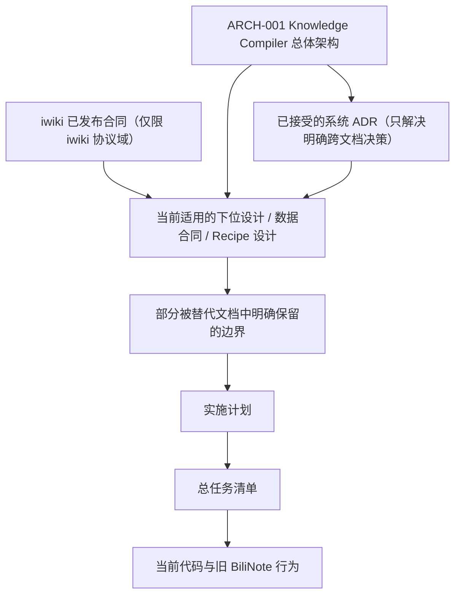
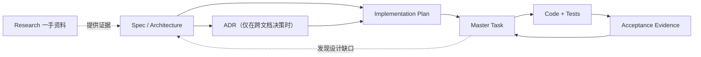

# AllToNote 文档控制面

- 文档状态：当前有效
- 最后核验：2026-07-20
- 适用仓库：`G:\AllToNote`
- 目的：定义文档存放规则、权威顺序、阅读顺序、文档关系和交接入口

本文是 AllToNote 文档的唯一入口。任何人或 AI 在设计、实现、评审或继续任务前，必须先阅读本文，再进入对应的上位设计、下位设计、实施计划和任务清单。

## 1. 第一原则

AllToNote 文档不是按日期决定权威，也不是所有 Markdown 都具有同等约束力。

使用文档时必须先回答：

1. 当前问题属于哪个协议域或产品域？
2. 该域的事实所有者是谁？
3. 哪份上位文档定义长期不变量？
4. 哪份下位文档只负责细化当前子系统？
5. 当前任务和代码是否仍与这些合同一致？

禁止使用以下判断方式：

- 日期最新，所以优先级最高；
- 当前代码已经这样写，所以设计必须服从代码；
- 实施计划写得更具体，所以可以覆盖上位架构；
- AllToNote 私有实现可以自行扩展 iwiki 已发布合同；
- 旧文档没有删除，所以其中所有描述仍然有效。

## 2. 权威顺序

发生冲突时，按以下顺序处理：

```text
iwiki 已发布的 Workspace / Schema / SDK / CLI / Validator 合同
  仅限 iwiki 拥有的协议域
    > AllToNote Knowledge Compiler 总体架构设计
    > 当前适用且已确认的下位设计
    > 早期产品设计中未被明确保留的同主题描述
    > 实施计划和任务清单
    > 当前代码和旧 BiliNote 行为
```

不同协议域按所有权协作，而不是由一个文档覆盖全部系统：

- iwiki 拥有 Workspace、Portable Schema、validate、commit、publish 和 index 的公开合同。
- Knowledge Compiler 总体架构拥有 AllToNote 的产品定位、领域模型、运行时边界和演进顺序。
- `ARCH-001` 当前明确：AllToNote 是上层知识编译/积累平台，Production 是用户用例，Video/Document/Article/Codebase/Personal 是并列顶层 Recipe，CLI/Desktop/MCP 只调用同一 ProduceService；CLI 仅发布单一 `produce` 主入口，不发布活跃 `add` 或独立 `run`。
- Portable 设计细化 AllToNote 如何消费和生产开放资产，但不能虚构 iwiki 尚未发布的能力。
- Vault、Video、长视频等下位设计只能细化总体架构，不能静默改变其不变量。
- 实施计划只决定执行步骤；任务清单只记录状态；代码只证明当前实现事实。

如确需改变上位不变量，先修订上位设计并记录决策，再修改下位设计、计划和代码。

## 3. 当前目录规则

当前采用“原路径稳定、增量治理”的目录结构，不在未完成分支合并前批量移动已有文件：

```text
docs/
├─ README.md                         # 唯一文档入口、阅读和存放规则
├─ superpowers/
│  ├─ specs/                         # 当前或仍需保留的正式设计规格
│  └─ plans/                         # 可执行实施计划和已完成计划记录
├─ tasks/
│  ├─ alltonote-master-tasks.md      # 唯一跨阶段总任务和 AI 交接入口
│  └─ alltonote-design-coverage-matrix.md # 设计、替代和实施映射
├─ research/                         # 一手资料调研与方案比较；不直接形成规范
├─ acceptance/                       # 稳定、脱敏、可复核的验收摘要
├─ decisions/                        # 跨文档架构决策 ADR
└─ history/                          # 已完全取代且无活动引用的历史快照（按需创建）
```

目录为空时不为形式完整而创建占位文件。新增目录必须对应真实文档职责。

### 3.1 `docs/superpowers/specs/`

存放正式设计规格，包括：

- 产品基线；
- 上位架构；
- 数据合同设计；
- 子系统设计；
- Recipe 专项设计（历史文件名中的 Producer 视为 Recipe 产品外观）；
- 仍有现行约束的部分历史设计。

规格回答“为什么做、边界是什么、谁拥有数据、接口和失败语义是什么、什么算完成”。

新规格命名：

```text
YYYY-MM-DD-<scope>-design.md
```

示例：

```text
2026-07-13-alltonote-knowledge-compiler-architecture-design.md
2026-07-14-alltonote-video-producer-design.md
```

### 3.2 `docs/superpowers/plans/`

存放从已确认规格拆出的实施计划。

计划回答：

- 任务顺序；
- 目标文件；
- 先写的失败测试；
- 最小实现；
- 验证命令；
- 提交边界。

计划不能新增或推翻架构决策。发现规格缺口时停止实现并回到规格层处理。

新计划建议命名：

```text
YYYY-MM-DD-<scope>-implementation-plan.md
```

现有未带 `implementation-plan` 后缀的文件保留原名，避免破坏引用。

### 3.3 `docs/tasks/`

存放跨阶段、持续更新的执行清单和 AI 交接状态。

任务文档必须明确：

- 当前代码工作树和分支；
- 已完成、部分完成、阻塞、未开始；
- 每项任务依赖的权威设计；
- 验收 Gate；
- 已知外部阻塞；
- 下一位执行者的第一步；
- 不允许重复执行或误报完成的事项。

当前入口：

- [`alltonote-master-tasks.md`](tasks/alltonote-master-tasks.md)
- [`alltonote-design-coverage-matrix.md`](tasks/alltonote-design-coverage-matrix.md)

子系统临时 `tasks.md` 可以保留在对应规格目录，但必须由总任务清单链接，不得形成第二份互相冲突的总进度。

### 3.4 `docs/research/`

存放面向某次架构决策或产品规划的一手资料调研。研究文档必须：

- 优先链接官方文档、标准和原始项目；
- 把外部事实、AllToNote 推论和最终决策分开；
- 标明调研日期与适用范围；
- 只为设计提供证据，不能覆盖设计或协议合同。

当前总体调研：

- [`AllToNote 市场与架构调研`](research/2026-07-18-alltonote-market-and-architecture-research.md)

### 3.5 `docs/acceptance/`

只存放稳定、脱敏、可复核的验收摘要，例如：

- 测试范围和结果；
- E2E 输入身份；
- Bundle/Quality/Receipt 标识；
- 性能数据；
- 已知限制；
- 恢复和零重放证据。

不得存放：

- Cookie、Token、API Key；
- 完整 Provider 原始响应；
- 用户私人正文副本；
- 只能在某台机器使用的秘密绝对路径；
- 大型临时缓存或模型中间产物。

大型真实产物保留在受控验收目录，文档只记录稳定摘要和必要定位。

### 3.6 `docs/decisions/`

只在跨越多份设计、改变长期不变量时新增 ADR。命名：

```text
ADR-XXXX-<decision>.md
```

ADR 至少包含：背景、决策、备选方案、影响、迁移方式和回滚条件。局部实现选择不要创建 ADR。

### 3.7 `docs/history/`

只有满足以下全部条件，才允许把文档移入历史目录：

1. 已有明确 `superseded_by`；
2. 当前规格不再引用其有效约束；
3. 仓库内链接已更新或保留重定向说明；
4. 移动不会破坏未合并 worktree；
5. 历史价值高于直接删除。

只“部分被取代”的文档不得直接移入 history；应保留原路径并明确哪些章节仍有效。

## 4. 文档类型与状态

新增或实质修改正式文档时，在标题后提供以下元数据；旧文档由任务 `DOC-02` 渐进补齐：

```yaml
doc_type: product | architecture | architecture-decision | contract-design | subsystem-design | plan | tasks | research | acceptance | history
status: draft | confirmed | active | partially-superseded | blocked | completed | superseded
authority: external-contract | system | subsystem | execution | evidence
upstream:
downstream:
supersedes:
superseded_by:
implementation_status:
last_verified_at:
```

状态含义：

| 状态 | 含义 |
|---|---|
| `draft` | 尚未确认，不得作为编码依据 |
| `confirmed` | 设计已确认，但未必已经实现 |
| `active` | 当前权威且仍约束实现 |
| `partially-superseded` | 部分边界仍有效，部分已由新文档取代 |
| `blocked` | 任务或验收受明确外部条件阻塞 |
| `completed` | 计划或任务已完成，作为审计记录保留 |
| `superseded` | 已被其他文档完全取代，不再作为当前依据 |

“设计是否有效”和“实现是否完成”必须分开。不能因为代码未实现就把设计标为过时，也不能因为测试通过就把设计状态自动改为完成。

## 5. 文档关系与优先级

AllToNote 同时有“规范权威”和“实施事实”两条轴，不能混为一谈：

- 回答“系统应该是什么”时，读外部合同、上位架构、ADR 和适用下位设计；
- 回答“当前到底做到了什么”时，读任务状态、当前代码、测试和验收证据；
- 代码可以证明实现事实，但不能因为已经存在就反向覆盖设计；
- 设计可以定义目标，但不能把尚未实现的能力写成已经可用。

### 5.1 规范权威顺序



最重要的结论：

- 在 AllToNote 自身产品、领域和执行模型内，[`ARCH-001`](superpowers/specs/2026-07-13-alltonote-knowledge-compiler-architecture-design.md) 优先级最高。
- 在 iwiki 拥有的 Workspace、Schema、SDK、CLI、Validator、commit/publish/index 协议域内，iwiki 当前已发布合同最高。
- 两者发生边界歧义时必须先确认“谁拥有这个协议”，不能靠文档日期决定。
- [`PROD-001`](superpowers/specs/2026-07-12-alltonote-llm-iwiki-desktop-design.md) 和旧 Codex 设计均为 `partially-superseded`，只允许使用文档头部明确保留的部分。
- Research 只提供证据，Plan 只提供步骤，Tasks 只提供状态，Acceptance 只证明已发生的验收；它们都不能静默修改设计。

### 5.2 从设计到可交付能力



每一项实现都必须能沿这条链反向追踪；任何孤立的代码、孤立计划或第二份总进度都不是权威交付。

## 6. 当前设计登记与层级

截至 2026-07-19，共有 **18 个正式设计 ID**：16 个当前有效，2 个部分被替代。完整逐项登记、实施计划、上位章节覆盖和替代关系只维护在：

- [`AllToNote 设计覆盖、替代关系与实施矩阵`](tasks/alltonote-design-coverage-matrix.md)

当前受治理的 Markdown 共 57 份：18 份正式设计、19 份实施计划、3 份任务/交接记录（含长视频子任务）、1 份 Research、1 份 ADR、14 份 Acceptance，以及本文。`specs/tasks.md` 是长视频实施记录，不计入 18 份正式设计。

这里仅保留稳定分层，避免复制第二份会漂移的全量表：

| 层级 | 设计 ID | 使用方式 |
|---|---|---|
| 外部协议 | iwiki published contracts | 只在 iwiki 所有的协议域内最高 |
| AllToNote 上位架构 | `ARCH-001` | AllToNote 自身范围最高，所有新子系统必须服从 |
| 产品基线 | `PROD-001` | 只保留本地优先、开放 Markdown、薄 Desktop、网站边界等明确有效原则 |
| 基础合同与运行时 | `DATA-001`、`RUNTIME-001`、`REC-CONTRACT-001` | 约束所有 Recipe、CLI、Pack 和 Portable 产物 |
| 知识工作区与消费 | `SUB-VAULT-001`、`REVIEW-001`、`MCP-READ-001` | 浏览、审阅、发布、Agent 读取 |
| 执行基础设施 | `ENGINE-001` | Engine 产品需求已触发，但生产实现必须等待 Wave 0-4；不是 foreground Recipe 的前置 |
| Recipe | `REC-VIDEO-001`、`REC-VIDEO-LONG-001`、`REC-WEB-001`、`REC-DOC-001`、`REC-CODE-001`、`REC-PERSONAL-001` | 并列顶层知识生产扩展的专项设计；不各自拥有 Runtime/Job/Publisher |
| 云与发布 | `CLOUD-001`、`RELEASE-001` | 网站控制面、公共知识和 Windows/macOS 分发 |
| 旧 Adapter 参考 | `ADP-CODEX-LEGACY-001` | 只读 app-server 协议参考，不拥有新模型执行架构 |

跨文档决策当前登记在：

- [`ADR-0001：机器运行状态必须位于 Vault 之外`](decisions/ADR-0001-machine-state-outside-vault.md)

## 7. 强制阅读规则

### 7.0 当前实施状态与硬依赖

- Wave 1A 已完成；其范围外的 Pack、Desktop Resolver、clean-machine 与分发仍待实现。
- Wave 0 已于 2026-07-21 通过；实际权威基线为 `3a75d0eb921acd2f5eac75d2033ae4d4e0e00cc3`，实现集成提交为 `066884da43105e000e00e389ab213274ca2fd6c5`。实现提交 trailer 中的 `3a75d0e410...` 是不可解析的抄录错误，验收记录已显式更正，不改写历史。
- X0-A Tasks 1–8 已完成并通过架构、兼容、冷路径、全量 backend 与 Windows smoke Gate；X0-A 只建立 submission/control-plane 接缝，不提供同 Workspace 多 Job 并发、detach、Engine 或 AgentExecutor，也未完成 Job/Repository/Bundle 数据面去 Video 化。X0-B pending，且必须由 Video 与真实 Document/PPT 第二消费者共同驱动，不能以伪消费者或纸面抽象代替。
- Review/Publisher、AgentExecutor 与 Thin Desktop 均 pending；旧 BiliNote UI 不等于 Thin Desktop 完成。
- Engine 的高并行、批量后台执行和本地 Agent 调度需求已经触发，但生产实现被 Wave 0-4 阻塞。
- 固定硬依赖链为：`Wave 0 -> X0-A -> C0 -> 真实 Document/PPT + X0-B -> Artifact/Review/Publisher -> Engine`。不再使用 Engine 触发决策菱形。
- CLI 只保留单一 `produce` 主入口，不发布活跃 `add` 或独立 `run`。

### 7.1 任意新 AI 的启动顺序

1. 阅读本文，先理解权威和目录规则。
2. 阅读 [`alltonote-master-tasks.md`](tasks/alltonote-master-tasks.md)，确认当前状态和推荐任务。
3. 阅读 [`alltonote-design-coverage-matrix.md`](tasks/alltonote-design-coverage-matrix.md)，找到任务对应的设计 ID、替代关系和实施计划。
4. 阅读 `ARCH-001`；只在处理 iwiki 协议时先核验 iwiki 当前 published capability/schema/validator。
5. 只阅读当前任务直接相关的下位设计、ADR 和计划，不把全部历史文档混成同一优先级。
6. 检查两个工作树的 `git status`、分支、差异和测试基线，确认当前实现事实。
7. 把且只把一个主任务标记为 `in_progress`，先建立失败测试或可复现证据，再实现。
8. 完成后写入验证命令、结果、性能/ID/hash/阻塞，并同步唯一总任务清单。

不得先读代码后凭现状反推目标架构，也不得因为计划比设计更具体就让计划覆盖设计。

### 7.2 按任务选择阅读路径

| 任务 | 必读顺序 |
|---|---|
| Runtime / CLI / Pack | `ARCH-001 -> RUNTIME-001 -> Runtime plan -> 当前 CLI/Job/Pack 代码` |
| Portable / iwiki | `iwiki published contract -> ARCH-001 -> DATA-001 -> Consumer/Provider contract tests` |
| Video / 长视频 | `ARCH-001 -> DATA-001 -> RUNTIME-001 -> REC-VIDEO-001 -> REC-VIDEO-LONG-001 -> Video release plan -> acceptance` |
| Vault / Desktop | `ARCH-001 -> PROD-001 保留边界 -> ADR-0001 -> SUB-VAULT-001 -> RUNTIME-001 -> Vault/Desktop plan` |
| Review / Publisher | `iwiki publish contract -> ARCH-001 -> DATA-001 -> SUB-VAULT-001 -> REVIEW-001 -> Review plan` |
| Knowledge MCP | `ARCH-001 -> SUB-VAULT-001 -> MCP-READ-001 -> MCP plan` |
| Engine / Production MCP | `ARCH-001 -> ADR-0001 -> ENGINE-001 -> master tasks 的 Wave 0-4 完成证据 -> Engine plan` |
| Article / Wiki | `ARCH-001 -> DATA-001 -> REC-CONTRACT-001 -> REC-WEB-001 -> Web plan` |
| PDF / PPT / OCR | `ARCH-001 -> DATA-001 -> REC-CONTRACT-001 -> REC-DOC-001 -> Document plan` |
| Codebase / UE5 | `ARCH-001 -> DATA-001 -> REC-CONTRACT-001 -> REC-CODE-001 -> Code plan` |
| Personal Work Digest | `ARCH-001 -> DATA-001 -> REC-CONTRACT-001 -> REC-PERSONAL-001 -> Personal plan` |
| 网站 / 公共知识 | `ARCH-001 -> PROD-001 保留网站边界 -> CLOUD-001 -> Site plan` |
| Windows / macOS 发布 | `ARCH-001 -> RUNTIME-001 -> RELEASE-001 -> Platform release plan` |
| Codex 模型调用 | `ARCH-001 ModelExecutor/AgentExecutor -> 当前 Coordinator/Bridge contracts -> 长视频合同 -> 旧 Codex 文档保留部分` |

### 7.3 必须停止并回到设计层的情况

- 当前需求会改变 Vault 的长期事实源、Publisher 权限、iwiki 合同或 Runtime/CLI 所有权；
- 计划要求的接口在设计中不存在，且不是单纯实现细节；
- 新职责只能通过复制第二条 Pipeline、第二个 JobStore 或把业务锁进 Desktop 才能完成；
- 旧文档与新文档冲突，但没有 `superseded_by` 或 ADR；
- 需要绕过 `Wave 0 -> X0-A -> C0 -> 真实 Document/PPT + X0-B -> Artifact/Review/Publisher -> Engine` 硬依赖链，引入常驻 Engine、公共插件 SDK、通用 Workflow/DAG 或网站保存个人正文；

## 8. 变更规则

1. 新功能先判断是否已有上位设计；没有时先补设计，不直接把新职责塞入相邻模块。
2. 下位设计引用上位文档，并声明自己不拥有的协议域。
3. 实施计划必须来自已确认设计，且每项任务有验证 Gate。
4. 完成任务后更新总任务清单；子任务清单不得成为孤立真相。
5. 设计和代码漂移时，先报告差异；不能静默修改文档以迁就偶然实现。
6. 不删除或覆盖用户现有未提交文档、代码和验收产物。
7. 文档不得保存 Secret、Cookie、完整认证材料或 Provider 原始敏感数据。
8. 文档移动必须先检查仓库内链接、外部 worktree 和分支差异。
9. 完成计划保留为审计记录，并标记 `completed`；不把所有完成计划继续当作当前待办。
10. 每次正式发布前核验：权威文档、实现、测试、CLI 协议和 Portable 合同一致。

## 9. 当前仓库事实

截至 2026-07-30：

- 文档主工作树：`G:\AllToNote`，分支 `codex/alltonote-wave0-baseline`，实际权威文档基线提交为 `3a75d0eb921acd2f5eac75d2033ae4d4e0e00cc3`。
- Video Recipe 实现工作树（历史目录名 `AllToNote-video-producer`）：`G:\AllToNote-video-producer`，分支 `codex/alltonote-x0a`。
- Video Recipe 的既有实现与测试已在本地 checkpoint `2b9e2b066e38d50ce040436d6b1995b845c61c28` 固化；实现侧 handoff/X0-A/Local Parallel 文档已在 `ff5e5de679771f21e089ae5d72cf72378b1a32be` 固化。
- 权威文档基线已集成到实现分支提交 `066884da43105e000e00e389ab213274ca2fd6c5`；实际来源提交与集成提交的 stable patch-id 均为 `9ca7ee7109ecdbbba7ba24526355e36a6ca7fabd`。实现提交 trailer 中的 `3a75d0e410...` 是不可解析的抄录错误，已在验收报告中更正而未改写历史。
- 集成后 backend 全量测试为 `1820 passed, 2 skipped, 1 warning, 3 subtests passed`；Windows 本地视频 smoke 为 `1 passed, 14 deselected, 1 warning`；`git diff --check` 通过。
- `.superpowers/` 与 `config/downloader.json` 仍是明确排除的本地未跟踪资产；未被清理、覆盖或纳入提交。
- Wave 0 与 X0-A 已关闭；X0-A 的最终验收见 `acceptance/2026-07-30-recipe-x0a-task-8.md`。下一条允许的实现主线是并发正确性 C0。
- 当前正式设计覆盖 18 个 ID；不得把 X0-A 解释为多 Recipe 数据面或并发 Engine 已完成，也不得跳过 C0 提前启动 X0-B 或 Engine production implementation。

下一个执行者必须先读取总任务清单中的 `HANDOFF-01`，再从“推荐执行波次”选择一个实际开发任务。
