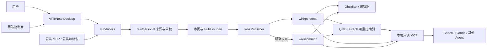

# AllToNote × llm-iwiki 本地优先知识库桌面系统设计

```yaml
doc_type: product
status: partially-superseded
authority: system
upstream:
  - 2026-07-13-alltonote-knowledge-compiler-architecture-design.md
superseded_by:
  - 2026-07-13-alltonote-knowledge-compiler-architecture-design.md
  - 2026-07-18-alltonote-runtime-cli-feature-pack-design.md
  - 2026-07-18-alltonote-review-publisher-design.md
  - 2026-07-18-alltonote-site-control-plane-design.md
implementation_status: product-baseline-retained-desktop-loop-pending
last_verified_at: 2026-07-18
```

- 日期：2026-07-12
- 状态：部分被后续细化设计替代；保留产品基线
- 目标平台：Windows Tier 1；macOS Tier 2
- 产品基线：桌面应用管理本地 Markdown 知识库；网站仅承担账号、邀请、下载、设备和公共 MCP 管理

> 仍然有效：本地优先、开放 Markdown、知识库与 AllToNote 解耦、CLI/Core 一等入口、薄 Desktop、网站不保存个人知识正文、`personal` 默认和 `common` 必须显式发布。已被替代：本文中的粗粒度进程、任务、Producer、Publisher、Runtime 和云端组件划分；这些内容以 Knowledge Compiler 总体架构及对应下位设计为准。

## 1. 摘要

AllToNote 将从“视频转笔记工具”演进为本地优先的知识生产与管理工作台。它负责采集资料、调用本地或远端 AI、生成草稿、人工审阅、安全发布、浏览检索和任务恢复；`llm-iwiki` 则作为独立的 Markdown 知识库本体和协议实现，负责定义开放磁盘结构、稳定 CLI/SDK、索引和查询能力。

两者采用“开放磁盘合同 + 稳定 iwiki CLI/SDK”的双层契约：任何应用都可以直接读取符合合同的 Markdown 文件；需要写入、发布、迁移、索引或查询时，应优先调用稳定的 `iwiki` 接口，而不是依赖 `llm-iwiki` 内部 Python 模块。

知识库中的 Markdown、附件和来源证据是唯一需要长期保存的数据。SQLite、QMD、图谱、缩略图、任务状态和其他缓存都是可删除、可重建的派生数据。用户即使卸载 AllToNote，也仍可使用 Obsidian、Codex、Claude Code、其他 Agent、编辑器或脚本继续访问知识库。

## 2. 产品定位与边界

### 2.1 AllToNote 的职责

AllToNote 是一个“可视化知识编译器”和本地知识工作台，主要职责包括：

1. 从视频、网页、PDF、Wiki、代码库、Git 活动、工作日志、会议记录、OCR 和公共 MCP 等来源采集信息。
2. 调用用户选择的本地或远端 AI，将来源整理为结构化 Markdown 草稿。
3. 提供高质量 Markdown 阅读、编辑、来源对照、差异审阅和发布体验。
4. 管理生产任务、失败恢复、冲突处理、索引状态和本地 MCP 服务。
5. 在不绑定专有数据库的前提下，提供比普通文件管理器更完整的知识生产流程。

AllToNote 不拥有知识库格式，也不把用户知识锁在应用数据库中。其本地任务数据库只保存可重建的运行状态，不是知识源。

### 2.2 llm-iwiki 的职责

`llm-iwiki` 是独立的知识库本体和协议实现，主要职责包括：

1. 定义 `raw/`、`wiki/`、来源证据、链接和元数据的磁盘合同。
2. 提供稳定的 `iwiki` CLI/SDK，用于检查、验证、规划发布、执行发布、查询和维护索引。
3. 维护 Markdown、QMD 索引和知识图谱之间的重建关系。
4. 允许 Obsidian、Agent、命令行工具和其他应用共同使用同一份本地知识库。

`llm-iwiki` 不依赖 AllToNote，也不包含 AllToNote 的 UI、账号、视频下载或模型配置逻辑。

### 2.3 网站的职责

网站不是知识库主应用，也不存储用户的个人 Markdown 知识库。第一阶段只承担：

- 账号注册、登录和邀请资格管理；
- 桌面客户端下载安装与版本发布；
- 设备登录、设备撤销和许可证状态；
- 公共 MCP、公共知识包和官方服务目录管理；
- 后续需要的订阅、配额或公告能力。

账号用于获取服务和管理设备，不决定本地知识文件的所有权。用户在离线状态下仍应能浏览、编辑和管理已经授权设备上的本地知识库；联网能力只在登录刷新、下载服务、远端 AI、远端 MCP 或公共资源同步时需要。

## 3. 核心原则

1. **Markdown 是事实源。** 知识正文、附件和证据保存在普通文件中，数据库只是派生物。
2. **本地优先。** 默认在本机完成存储、阅读、索引和 Agent 访问；远端传输必须由用户明确选择。
3. **生产与发布分离。** Producer 只能写来源与草稿，Publisher 才能把审阅后的内容发布为正式知识。
4. **个人优先。** 新内容默认进入 `personal`；发布到 `common` 必须是明确操作。
5. **互操作优先。** Obsidian、Agent、编辑器和脚本可以绕过 AllToNote 直接读取 Markdown。
6. **稳定接口优先。** AllToNote 不导入 `llm-iwiki/tools/*.py` 等内部实现，只依赖公开合同和版本化接口。
7. **索引可重建。** QMD 或图谱失败不能使已经安全写入的 Markdown 失效。
8. **最小权限。** 本地 MCP 默认只读已发布知识；Agent 不能绕过审阅直接发布或删除正式知识。
9. **失败可恢复。** 长任务和发布事务必须在进程退出、断电、磁盘不足或外部编辑冲突后给出确定状态。
10. **平台能力隔离。** 文件监听、凭据、进程、更新和系统集成通过平台适配层实现，避免业务代码散落平台判断。

## 4. 系统上下文



依赖方向只能是 AllToNote 指向 `llm-iwiki` 的公开合同和运行时。`llm-iwiki` 不反向依赖 AllToNote。两者保持独立仓库和独立发布周期。

## 5. 开放磁盘合同

### 5.1 工作区结构

一个受支持的知识库工作区至少包含以下结构：

```text
<workspace>/
├─ .llm-wiki/
│  └─ manifest.yaml
├─ raw/
│  ├─ common/
│  └─ personal/
├─ wiki/
│  ├─ common/
│  └─ personal/
└─ .cache/
   ├─ alltonote/
   └─ qmd/
```

目录语义如下：

- `raw/`：来源材料、转录、结构化元数据和待审草稿；不是对外稳定知识。
- `wiki/`：经过发布流程确认的正式 Markdown 知识；是 Obsidian 和 Agent 的默认读取范围。
- `common/`：可共享、可分发、适合团队或公共领域复用的知识。
- `personal/`：用户私有、适应个人工作方式和语境的知识。
- `.cache/`：可删除的任务状态、索引、事务日志和临时产物，不应作为知识事实源。

`wiki/` 本身就是 Obsidian Vault。AllToNote 不要求改变用户现有的 `.obsidian/` 配置，也不将 `.obsidian/` 纳入业务合同。

### 5.2 工作区清单

工作区根目录必须提供已提交的 `.llm-wiki/manifest.yaml`，用于机器发现和兼容性判断。建议初始格式如下：

```yaml
schema_version: 2
workspace_id: "018f0000-0000-7000-8000-000000000000"
name: "My LLM Wiki"
paths:
  raw_common: "raw/common"
  raw_personal: "raw/personal"
  wiki_common: "wiki/common"
  wiki_personal: "wiki/personal"
  cache: ".cache"
defaults:
  publish_scope: "personal"
  visibility: "private"
  encoding: "utf-8"
  link_style: "wikilink"
description: "Personal and shared Markdown knowledge workspace."
```

约束：

- 清单路径必须是相对工作区根目录的规范路径。
- `schema_version` 高于客户端支持版本时，AllToNote 只能以只读模式打开。
- 旧版本迁移必须先生成 dry-run 报告，再创建备份，最后由用户确认执行。
- `schema_version` 只表示磁盘格式，不能替代 CLI 协议版本。
- 清单属于稳定合同，不得存放访问令牌、API Key、账号或设备秘密。

### 5.3 正式知识布局

公共知识保持较稳定的领域和模块结构：

```text
wiki/common/<engine-or-domain>/<module>/index.md
wiki/common/<engine-or-domain>/<module>/<topic>.md
```

个人知识允许按用户习惯形成自适应领域：

```text
wiki/personal/<auto-domain>/index.md
wiki/personal/<auto-domain>/<note>.md
```

链接优先使用 Obsidian 兼容的 wikilink，并允许别名和标题锚点。来源证据应靠近对应知识文档，避免另建只能由某个应用解释的黑盒引用数据库。

## 6. Producer：来源采集与草稿生成

### 6.1 Producer 合同

每一种知识来源由独立 Producer 负责。首个实现为 `VideoNoteProducer`，后续可以新增：

- Web Crawler Producer；
- PDF / Office 文档 Producer；
- Wiki Producer；
- Codebase Index Producer；
- Git Activity Producer；
- Work Log / Meeting Producer；
- OCR Producer；
- Public MCP Producer。

Producer 的权限边界固定为：采集来源、规范化元数据、生成转录和草稿。Producer 不得直接写入 `wiki/`，不得更新正式索引，不得覆盖或删除已发布知识，也不得把内容自动发布到 `common`。

### 6.2 Source Bundle

视频来源默认写入个人原始区：

```text
raw/personal/<domain>/<source-id>/
├─ source.yaml
├─ metadata.json
├─ transcript.md
├─ draft.md
└─ screenshots/
```

字段职责：

- `source.yaml`：来源类型、原始 URL 或本地引用、采集时间、生产器名称及版本、内容哈希。
- `metadata.json`：平台返回的结构化元数据和技术信息。
- `transcript.md`：可阅读、可引用、带时间戳的转录正文。
- `draft.md`：尚未发布的知识草稿。
- `screenshots/`：被草稿引用的关键帧或来源图片。

未完成任务先写入 `.cache/alltonote/jobs/<job-id>/staging/`。只有 Source Bundle 达到最低完整性并通过校验后，才原子提交到 `raw/personal`，避免半成品混入长期来源目录。

网络视频默认不长期保留原始媒体，只保存 URL、元数据、转录、必要截图和用户选择的衍生产物。处理本地视频时默认保留对原文件的引用；只有用户明确选择归档，才复制原媒体到工作区。

### 6.3 AI 运行方式

每个 Producer 可以调用：

- OpenAI、兼容 OpenAI 协议的云端模型或其他供应商 API；
- 本地模型服务；
- 已安装的 Codex `app-server --stdio`；
- 后续增加的本地推理运行时。

模型和供应商是可替换执行器，不进入知识库合同。知识文件只记录足够的生成来源和模型元数据，不保存凭据。用户应能在任务开始前看见是否会把私有内容发送到远端服务。

## 7. Publisher：从草稿到正式知识

### 7.1 发布原则

发布是独立于 Producer 的安全操作。默认目标是 `wiki/personal`，必须经过用户审阅。发布到 `wiki/common` 需要额外的明确操作，并展示完整差异、来源证据和 lint 结果。

所有发布先生成 Publish Plan，计划至少包含：

- 目标工作区、范围和目标路径；
- 输入草稿与来源引用；
- 目标文件的预条件哈希；
- 将创建、修改或拒绝的文件；
- index.md 或反向链接的计划更新；
- 校验结果、冲突和警告；
- 发布成功后的索引刷新动作。

UI 只展示计划并收集确认，真正的路径验证、冲突判断和文件事务由 `iwiki apply-publish` 执行。

### 7.2 并发编辑与冲突

用户可能同时通过 Obsidian、Agent 或文本编辑器修改知识文件。Publisher 必须保存计划生成时的 base hash，并在应用计划前重新计算 current hash：

- 哈希一致：允许继续。
- 哈希不同：进入 `Conflict`，禁止静默覆盖。
- 目标为新文件但已经存在：同样视为冲突。

解决冲突时 UI 提供 base、current、proposed 三方对照。首版可以支持“重新生成计划”“另存为新文档”和“用户手工合并”，不要求自动语义合并。

### 7.3 原子性与回滚

发布使用临时文件、同卷原子替换、工作区级文件锁和事务日志。每次发布在以下目录留下可恢复状态：

```text
.cache/alltonote/transactions/<transaction-id>/
├─ plan.json
├─ state.json
├─ backup/
└─ result.json
```

在修改正式文件前备份受影响内容；只有所有 Markdown 写入和合同校验成功，发布事务才标记为 committed。进程在中途退出时，下次启动根据事务日志完成回滚或恢复，不通过猜测当前目录状态继续执行。

Markdown 提交成功后再刷新 QMD 或图谱。索引失败将状态标记为 `IndexStale`，不得回滚已经发布且有效的 Markdown。

## 8. 稳定 iwiki CLI/SDK

### 8.1 接口范围

`llm-iwiki` 需要把当前内部脚本整理为可自动化、可版本协商的稳定接口。首版公开命令：

```text
iwiki inspect --workspace <path> --json
iwiki validate --workspace <path> --json
iwiki query --workspace <path> --scope <personal|common|combined> --json
iwiki plan-publish --workspace <path> --request <file> --json
iwiki apply-publish --workspace <path> --plan <file> --json
iwiki index status --workspace <path> --json
iwiki index refresh --workspace <path> --json
iwiki index rebuild --workspace <path> --json
```

所有给 AllToNote 调用的命令必须：

- 在 stdout 输出版本化 JSON，不混入人类日志；
- 将诊断日志输出到 stderr；
- 使用稳定退出码区分参数错误、合同错误、冲突、权限错误、可重试运行时错误和内部错误；
- 支持非交互模式，不在后台等待终端输入；
- 对相同输入给出可预测结果；
- 不暴露内部 Python 文件路径作为公共 API。

### 8.2 版本与能力协商

磁盘合同和自动化协议分别版本化：

- `schema_version`：工作区磁盘结构版本。
- `cli_protocol_version`：命令、JSON 字段、错误码和能力协商版本。

`iwiki inspect` 返回：

- 当前工作区 schema；
- CLI 协议版本；
- 支持的 schema 范围；
- `plan_publish`、`atomic_publish`、`qmd`、`graph`、`mcp_read` 等 capabilities；
- 工作区路径、只读原因和索引状态。

AllToNote 必须根据 capability 使用功能，不通过版本号猜测某个功能存在。缺少能力时 UI 降级或明确提示升级，不能调用内部脚本绕过合同。

### 8.3 SDK 边界

首版可以先以 CLI 作为进程隔离的稳定边界；之后提供 SDK 时，SDK 也只封装公开协议和数据类型。AllToNote 不复制一份 `llm-iwiki` schema 模板，也不在自身代码中形成第二套发布规则。

## 9. Markdown、Obsidian 与文件监听

### 9.1 Markdown 能力

AllToNote 阅读器和编辑器至少支持：

- CommonMark / GitHub Flavored Markdown 基础语法；
- YAML frontmatter；
- Obsidian wikilink、别名和标题锚点；
- 本地图片和附件；
- Mermaid；
- KaTeX 数学公式；
- 代码块和语法高亮；
- Callout；
- 视频时间戳链接。

应用不得自动重写用户的 `.obsidian/`。Markdown 扩展若存在渲染差异，文件内容仍以可被普通文本工具阅读为最低保证。

### 9.2 文件监听

Workspace Watcher 监听 `raw/`、`wiki/` 和 `.llm-wiki/manifest.yaml`，忽略 `.cache/`、`.git/`、`.obsidian/` 以及应用自己的临时文件。事件经过防抖和归并后触发增量元数据刷新和索引更新。

监听只是性能优化，不是正确性来源。文件系统事件丢失、应用休眠或监听器重启后，系统必须能通过轻量 reconcile 重新发现变化，而不是要求用户删除工作区重建。

## 10. 索引与检索

### 10.1 索引边界

AllToNote 通过 `KnowledgeIndex` 接口使用索引，QMD 是首个适配器，知识图谱是独立的可选派生层。任何索引都可以从 `wiki/` 重建。

索引状态统一为：

- `missing`：尚未建立；
- `building`：正在构建；
- `ready`：与当前 Markdown 一致；
- `stale`：Markdown 已变化但索引尚未追平；
- `failed`：最近一次构建失败。

即使索引缺失、构建中或失败，用户仍可直接浏览目录和打开 Markdown。

### 10.2 范围隔离

查询在检索前就必须确定范围，不能先检索全部文档再在结果层过滤。UI 提供：

- Personal：只查询 `wiki/personal`；
- Public：只查询 `wiki/common`；
- Combined：查询两者并明确标记每条结果的来源范围。

QMD 当前偏向公共游戏引擎知识的默认上下文需要泛化，使个人知识库、工作日志和其他领域也能得到中立结果。

## 11. 本地 MCP 与 Agent 访问

### 11.1 首版能力

本地 MCP 以 stdio 方式运行，不开放常驻 HTTP 端口。它复用 `iwiki` 的读取和查询运行时，默认只读已发布的 `wiki/`，提供：

- `workspace_info`；
- `search_knowledge`；
- `read_document`；
- `list_recent`；
- `list_related`；
- `get_document_sources`；
- `index_status`。

工具参数使用工作区相对路径或文档 ID，不接受任意绝对路径。响应包含范围、来源、更新时间和必要的索引新鲜度信息。

### 11.2 权限模型

本地 MCP 首版禁止：

- 任意文件系统路径读取；
- 任意命令执行或环境变量读取；
- 获取 API Key、Cookie、账号令牌或系统凭据；
- 发布、覆盖、删除、重命名正式知识；
- 写入 `wiki/common`；
- 绕过 Publisher 修改索引入口。

`raw/personal` 默认不向 Agent 暴露，因为其中可能包含未审阅、敏感或受版权约束的来源。未来如增加写能力，只允许 `create_draft` 在 `raw/personal` 创建受限草稿；正式发布仍必须经过 Publisher 和用户确认。

### 11.3 公共 MCP 与公共知识包

远端公共 MCP 有两种使用方式：

1. 临时查询：结果只用于当前会话，不落入个人知识库。
2. 导入来源：通过 Public MCP Producer 保存到 `raw/personal`，经用户审阅后再发布。

远端内容不得自动写入 `wiki/common`。下载的公共知识包以只读方式管理；用户需要修改时，复制或派生到 `personal`，避免本地改动在包升级时被覆盖。

## 12. 任务模型与故障恢复

### 12.1 本地任务状态

AllToNote 使用 `.cache/alltonote/jobs.sqlite` 保存可恢复的任务状态。该数据库可以删除，不承载唯一知识；删除后只会丢失运行历史和恢复点，不会丢失已经提交的 raw 或 wiki 文件。

标准状态机为：

```text
Created
  -> Capturing
  -> RawStaged
  -> Transcribing
  -> Drafting
  -> AwaitingReview
  -> Publishing
  -> Published
```

任何阶段可进入：

- `FailedRetryable`；
- `FailedTerminal`；
- `Conflict`；
- `ValidationFailed`；
- `Cancelled`。

每个阶段只在产物完整写入并校验后推进。应用重启时从最后一个完成的 checkpoint 恢复。涉及付费 AI 请求时不能盲目自动重试；若无法判断远端请求是否已经计费或完成，应提示用户选择继续。

### 12.2 运行时依赖

FFmpeg、Whisper、Codex app-server、iwiki CLI 和 QMD 都由 `ProcessSupervisor` 管理，统一处理启动、超时、取消、崩溃、日志和退出码。后台进程不得继承不必要的全量环境变量或工作区外权限。

## 13. 安全与隐私

### 13.1 文件系统安全

所有来自 UI、MCP、Markdown 链接或外部元数据的路径必须经过统一解析：

- 拒绝绝对路径和 `..` 越界；
- 规范化 URL 编码和 Unicode 路径；
- 校验 Windows junction、符号链接和 macOS symlink 的最终目标仍在授权根目录；
- 禁止写入 `.git/`、凭据目录和工作区合同外路径；
- 使用 canonical path 做最终授权判断，而不是仅检查字符串前缀。

### 13.2 Markdown 渲染安全

Markdown 阅读器对 HTML 进行白名单化处理，阻止 `javascript:` URL 和危险内联脚本。SVG、Mermaid 和外部图片采用受限渲染策略；外部图片默认提示或代理策略应避免在无感知情况下泄露 IP、Referer 或阅读行为。

### 13.3 凭据安全

API Key、Cookie、登录令牌和设备凭据保存在：

- Windows：Credential Manager 或 DPAPI 保护的应用存储；
- macOS：Keychain。

凭据不得写入 Markdown、`.cache/`、日志、崩溃报告或 Git。UI 返回供应商列表时只返回掩码和配置状态，不返回明文密钥。

当前 Tauri 中允许任意命令执行和读取完整环境的通用接口需要在实施阶段删除或收敛为白名单命令。桌面后端只监听 loopback，使用每次启动生成的会话令牌，并限制允许的 Origin；不以 `0.0.0.0` 暴露本地知识服务。

### 13.4 远端数据边界

任何可能把个人转录、草稿或正式知识发送到远端 AI、远端 MCP 或遥测服务的操作，都必须显示目标服务和数据范围，并由用户明确选择。默认不上传个人知识库，不采集知识正文作为产品分析数据。

## 14. 平台与分发

### 14.1 Windows Tier 1

首发支持 Windows 10/11 x64，交付要求包括：

- 签名安装包和签名自动更新；
- 明确管理 WebView2、FFmpeg、Python sidecar、Whisper、iwiki CLI 和 QMD 的安装状态；
- 自动探测用户已经安装的 Codex，不把 Codex 直接打包进应用；
- 兼容中文、空格、长路径、不同盘符和常见杀毒软件行为；
- 对大模型权重采用按需下载，不让基础安装包携带全部可选模型；
- 首次使用视频功能时完成 FFmpeg 准备和能力检查。

### 14.2 macOS Tier 2

如果共享核心和平台适配层能够复用，则支持 macOS，Apple Silicon 优先。发布前必须补齐：

- 应用签名和 notarization；
- Keychain 凭据存储；
- 平台文件监听和进程管理；
- 自动更新；
- FFmpeg、Whisper、iwiki 和 MCP 的平台端到端测试。

Intel Mac 不作为首期承诺，Linux 不进入第一阶段范围。

### 14.3 平台适配层

共享业务层只依赖以下接口：

- `ProcessSupervisor`；
- `CredentialStore`；
- `FileWatcher`；
- `Updater`；
- `SystemIntegration`。

平台差异在适配器内实现，避免视频生产、Publisher、索引和 MCP 代码散落 Windows/macOS 分支。

## 15. 性能目标

10,000 篇 Markdown 是首版强制基线，50,000 篇作为观察性压力测试：

- 已有可用索引时，打开工作区到 UI 可操作不超过 3 秒；
- 单个外部文件编辑在正常文件系统事件下 2 秒内反映到 UI；
- 索引 ready 时，本地搜索 p95 不超过 500 毫秒；
- 启动和普通浏览不得在 UI 线程执行全量目录扫描；
- 重建索引期间仍可直接浏览和打开文件；
- 视频处理和模型推理不阻塞渲染线程。

这些指标在 Windows Tier 1 的基准机器和固定测试工作区上测量，实施计划需补充机器规格和测量脚本。

## 16. 测试策略

### 16.1 合同测试

`llm-iwiki` 提供磁盘合同和 CLI JSON golden tests，覆盖：

- 支持与不支持的 schema；
- capability negotiation；
- 路径和元数据校验；
- Publish Plan 稳定性；
- 冲突、错误码和原子发布；
- 索引删除后的完整重建。

AllToNote 使用固定 golden workspace 做跨仓库兼容测试，防止任一项目单独升级后破坏集成。

### 16.2 AllToNote 测试

需要覆盖：

- Producer 的 Source Bundle 完整性；
- 任务状态机、checkpoint 和取消；
- 发布审阅和 common 显式确认；
- Obsidian 外部编辑后的 watcher 和冲突；
- Markdown 渲染及恶意内容隔离；
- 本地 MCP 工具权限和路径越界；
- 凭据不进入日志和文件；
- Windows 安装、升级、卸载和重装；
- macOS Tier 2 对应的平台端到端流程。

### 16.3 故障注入

端到端测试至少模拟：

- 网络超时、429、鉴权过期；
- Codex、FFmpeg、Whisper 或 iwiki 子进程崩溃；
- 强制退出、断电等价中断；
- 磁盘已满、目录只读；
- Obsidian 在发布瞬间保存同一文件；
- QMD 构建失败或索引损坏；
- 工作区 schema 高于客户端；
- symlink/junction 越界；
- 恶意 Markdown；
- 网站登录或设备令牌过期。

## 17. 验收链路

最小可交付版本必须完整证明以下闭环：

1. 用户选择一个现有 `llm-iwiki` 工作区并通过 manifest 校验。
2. AllToNote 在不建立专有知识数据库的情况下浏览并渲染 `wiki/`。
3. 用户用 Obsidian 修改同一 Vault，AllToNote 能检测变化且不破坏 `.obsidian/`。
4. 用户输入视频来源，系统生成完整 Source Bundle 和个人草稿。
5. 用户查看来源、修改草稿、查看 Publish Plan，并发布到 `wiki/personal`。
6. 发布使用哈希预条件和事务日志，外部并发编辑不会被静默覆盖。
7. QMD 成功增量刷新；若刷新失败，Markdown 仍可浏览且 UI 明确显示索引 stale/failed。
8. 本地 Codex 或其他 Agent 通过 stdio MCP 搜索、读取已发布知识。
9. Agent 无法通过 MCP 直接发布、覆盖或删除 `wiki/`，也无法默认读取 `raw/personal`。
10. 删除 `.cache/` 后，Markdown 保持完整，索引可以重建。
11. 卸载 AllToNote 后，Obsidian 和普通文件工具仍可完整使用知识库。

## 18. 实施阶段

### Phase 0：稳定 llm-iwiki V2

先完成并提交当前 `llm-iwiki` 的 V2 迁移，明确 `raw/common`、`raw/personal`、`wiki/common`、`wiki/personal` 的真实状态。迁移尚未稳定前，AllToNote 不针对未提交内部结构开发写入逻辑。

### Phase 1：manifest 与稳定 iwiki CLI

在 `llm-iwiki` 实现 manifest、inspect、validate、Publish Plan、原子 apply、索引状态和版本化 JSON 协议，并建立合同测试。

### Phase 2：AllToNote 只读工作区

实现工作区选择、兼容性检查、目录浏览、Markdown 渲染、文件监听、范围检索和索引状态。此阶段不写正式知识。

### Phase 3：VideoNoteProducer 与 Publisher

把现有视频转录和笔记生成流程改造成 Source Bundle Producer，加入任务恢复、草稿审阅、Publish Plan、冲突检测和个人发布闭环。

### Phase 4：知识管理体验

增加来源查看、反向链接、相关文档、历史差异、重命名/移动的安全计划，以及个人和公共范围的清晰管理。

### Phase 5：本地 MCP

提供只读 stdio MCP，使本地 Codex 和其他 Agent 能读取已发布知识，并完成路径、权限和隐私审计。

### Phase 6：公共 MCP 与知识包

接入网站公共服务目录，实现远端临时查询、来源导入和只读公共知识包管理。

### Phase 7：其他 Producers

按真实需求依次增加网页、PDF、Wiki、代码库、Git 活动、工作日志、会议和 OCR 等 Producer，不提前建立空泛插件框架。

### Phase 8：macOS

在 Windows 闭环稳定且平台适配层验证可复用后，完成 Apple Silicon 的签名、notarization、Keychain、依赖打包和端到端测试。

## 19. 明确不做的事项

首期不包含：

- 把个人知识正文同步到网站数据库；
- 多人实时协同编辑；
- 自动把草稿发布到 `common`；
- 允许 Agent 直接修改正式知识；
- 用 QMD、SQLite 或向量数据库替代 Markdown 事实源；
- 把 `llm-iwiki` 合并进 AllToNote 单仓库；
- 为尚未出现的来源提前设计通用插件市场；
- 首发承诺 Linux 或 Intel Mac；
- 内置或重新分发 Codex 本体。

## 20. 关键决策记录

1. 选择桌面应用，而不是“网页 + Local Agent”，因为桌面形态更适合文件系统、FFmpeg、Whisper、Codex、MCP、文件监听和离线知识管理，安装与故障边界也更清晰。
2. 选择独立项目集成，而不是把 `llm-iwiki` 复制或嵌入 AllToNote，避免出现两套 schema 和相互锁死的发布周期。
3. 选择 Producer/Publisher 分离，避免 AI 生成内容未经审阅污染正式知识。
4. 选择 personal 默认、common 显式发布，降低隐私泄露和公共知识质量下降的风险。
5. 选择 stdio 本地 MCP，避免本地开放网络端口和额外鉴权面。
6. 选择 Markdown-first、索引可重建，使知识可以被任意工具使用，并确保应用、索引或账号服务失效时用户仍拥有数据。

## 21. 后续计划入口

本设计确认后，实施计划应从 Phase 0 和 Phase 1 开始拆解，并分别明确两个仓库的变更边界、合同测试、版本策略和验收命令。任何 AllToNote 写入功能都以稳定的 `iwiki plan-publish/apply-publish` 可用为前置条件。
