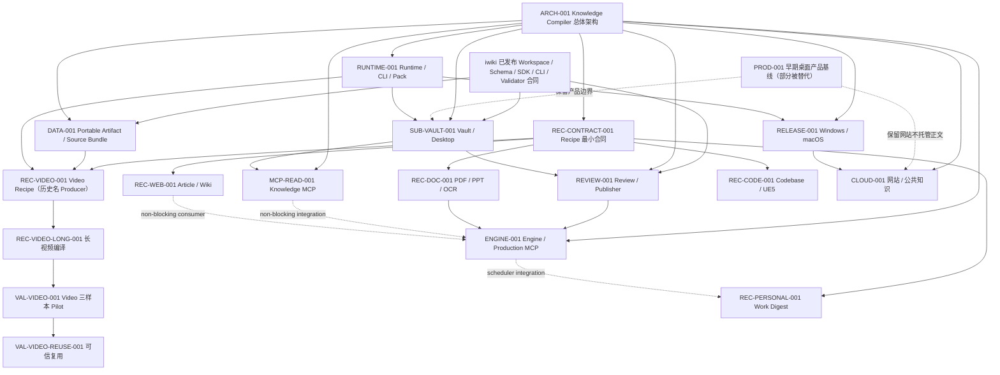
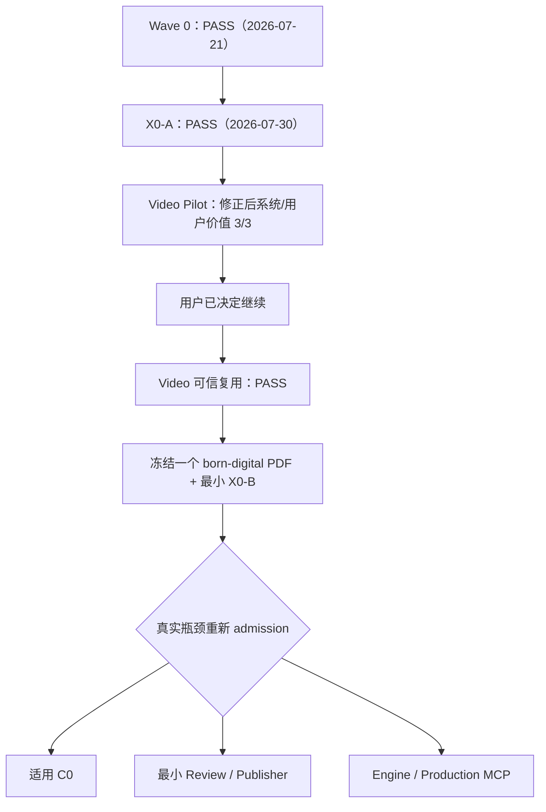

# AllToNote 设计覆盖、替代关系与实施矩阵

```yaml
doc_type: tasks
status: active
authority: execution
upstream:
  - ../README.md
  - ../superpowers/specs/2026-07-13-alltonote-knowledge-compiler-architecture-design.md
downstream:
  - alltonote-master-tasks.md
implementation_status: live-tracking
last_verified_at: 2026-07-30
```

## 1. 本表回答什么

本表用于判断：

- 上位 Knowledge Compiler 的每个领域是否已有详细下位设计；
- 应读哪一份设计和实施计划；
- 哪些旧文档仍有效、哪些局部已被替代；
- 当前代码完成到哪一层；
- 下一位 AI 是否可以实施，还是仍需补设计/外部条件。

它是进度和导航，不高于上位设计或 iwiki 已发布合同。

## 2. 关系总图



虚线表示旧产品文档只保留仍有效的产品边界，或表示非阻塞集成关系；实线表示设计依赖。当前执行 admission 以第 7 节为准：`三样本 Pilot -> Video 可信复用验证 -> 一个 born-digital PDF + X0-B -> 按真实瓶颈重新 admission`。既有 C0、Review/Publisher 和 Engine 技术设计保留，但不再从 X0-A 自动进入实现。

## 3. 设计登记表

| ID | 当前设计 | 权威 | 实施计划 | 设计状态 | 实现状态 |
|---|---|---|---|---|---|
| `ARCH-001` | [Knowledge Compiler 总体架构](../superpowers/specs/2026-07-13-alltonote-knowledge-compiler-architecture-design.md) | AllToNote 系统最高 | 由各下位计划实现 | active | 已明确 AllToNote > Production > Recipe；基础合同 + Video 纵切已实现，多 Recipe 接缝与整体路线未完成 |
| `PROD-001` | [AllToNote × llm-iwiki 桌面产品](../superpowers/specs/2026-07-12-alltonote-llm-iwiki-desktop-design.md) | 产品基线 | 已被新计划拆分 | partially-superseded | 部分基础，桌面闭环未完成 |
| `SUB-VAULT-001` | [CLI-First Vault](../superpowers/specs/2026-07-13-alltonote-cli-first-vault-workspace-design.md) | Vault/Desktop | [Vault/Desktop plan](../superpowers/plans/2026-07-18-alltonote-vault-desktop-implementation-plan.md) | active（JobStore 局部已修正） | 只读 foundation 计划存在，完整实现未完成 |
| `DATA-001` | [Portable Artifact / Source Bundle](../superpowers/specs/2026-07-14-alltonote-portable-artifact-source-bundle-design.md) | AllToNote 数据设计；iwiki 合同更高 | [已有 foundation plan](../superpowers/plans/2026-07-14-llm-iwiki-portable-contract-foundation.md) | active | v1 基础、semantic validate、atomic commit、多 Draft 已实现 |
| `RUNTIME-001` | [Runtime / CLI / Feature Pack](../superpowers/specs/2026-07-18-alltonote-runtime-cli-feature-pack-design.md) | Runtime/部署 | [实施计划](../superpowers/plans/2026-07-18-alltonote-runtime-cli-feature-pack-implementation-plan.md) | active | RCP-00..07 / Wave 1A 已验收；RCP-08+ Pack/Desktop/分发未完成 |
| `REC-CONTRACT-001` | [Recipe 最小扩展合同](../superpowers/specs/2026-07-18-alltonote-recipe-extension-contract-design.md) | 多 Recipe 接缝 | [实施计划](../superpowers/plans/2026-07-18-alltonote-recipe-extension-contract-implementation-plan.md) | active | X0-A Tasks 1–8 已验收；X0-B pending，且必须由真实 Document/PPT 第二消费者驱动；CLI 仅单一 `produce`，无活跃 `add`/独立 `run` |
| `REC-VIDEO-001` | [Video Recipe（历史名 Video Producer）](../superpowers/specs/2026-07-14-alltonote-video-producer-design.md) | Video Recipe | [原计划](../superpowers/plans/2026-07-14-alltonote-video-producer.md) + [发布收敛](../superpowers/plans/2026-07-18-alltonote-video-release-implementation-plan.md) | active | VREL-00/01 CLI seam 已验收；VREL-02..11 真实发布矩阵未闭合；通用 facade 迁移属于 Recipe X0 |
| `REC-VIDEO-LONG-001` | [长视频知识编译](../superpowers/specs/2026-07-16-alltonote-long-video-knowledge-compilation-design.md) | Transcript -> Draft/Quality | 原 tasks + Video release plan | active | Knowledge/Faithful core 已实现；实时 YouTube acquisition 外部阻塞 |
| `VAL-VIDEO-001` | [Video 三样本 Pilot](../design-docs/video-dogfood-validation/spec.md) | 当前产品证据 Gate | [阶段任务](../design-docs/video-dogfood-validation/tasks.md) + [冻结样本](../design-docs/video-dogfood-validation/samples.md) + [技术结果](../design-docs/video-dogfood-validation/report.md) | active | Pilot closed；首次系统 `2/3`，链路修复后 `3/3`；用户原值 `2/3`，术语修正与 V03 重评后 `3/3`；保留 reliability gap |
| `VAL-VIDEO-REUSE-001` | [Video 可信复用验证](../design-docs/video-trusted-reuse-validation/spec.md) | 保留、延迟检索与真实复用 Gate | [观察任务](../design-docs/video-trusted-reuse-validation/tasks.md) + [观察日志](../design-docs/video-trusted-reuse-validation/observation-log.md) | active | `PASS by explicit user override`；用户提前结束观察并授权继续，逐项指标不伪造 |
| `REVIEW-001` | [Review / Publisher](../superpowers/specs/2026-07-18-alltonote-review-publisher-design.md) | 审阅/正式写入 | [实施计划](../superpowers/plans/2026-07-18-alltonote-review-publisher-implementation-plan.md) | active | 未实现 |
| `MCP-READ-001` | [Knowledge Access MCP](../superpowers/specs/2026-07-18-alltonote-knowledge-access-mcp-design.md) | 本地/公共只读知识 | [实施计划](../superpowers/plans/2026-07-18-alltonote-knowledge-access-mcp-implementation-plan.md) | active | 未实现 |
| `ENGINE-001` | [Engine / Production MCP](../superpowers/specs/2026-07-18-alltonote-engine-production-mcp-design.md) | 后台执行/生产 Agent 接口 | [实施计划](../superpowers/plans/2026-07-18-alltonote-engine-production-mcp-implementation-plan.md) | active | 设计保留；当前实现 deferred，等待可信复用后的真实多 Job/后台瓶颈与技术 re-admission |
| `REC-WEB-001` | [Article / Wiki Recipe](../superpowers/specs/2026-07-18-alltonote-article-wiki-recipe-design.md) | Web/Wiki | [实施计划](../superpowers/plans/2026-07-18-alltonote-article-wiki-recipe-implementation-plan.md) | active | 未实现 |
| `REC-DOC-001` | [PDF / PPT / OCR Recipe](../superpowers/specs/2026-07-18-alltonote-document-recipe-design.md) | Document | [实施计划](../superpowers/plans/2026-07-18-alltonote-document-recipe-implementation-plan.md) | active | 未实现 |
| `REC-CODE-001` | [Codebase / UE5 Recipe](../superpowers/specs/2026-07-18-alltonote-codebase-ue5-recipe-design.md) | Code/UE5 | [实施计划](../superpowers/plans/2026-07-18-alltonote-codebase-ue5-recipe-implementation-plan.md) | active | 未实现 |
| `REC-PERSONAL-001` | [Personal Work Digest](../superpowers/specs/2026-07-18-alltonote-personal-work-digest-design.md) | 个人工作整理 | [实施计划](../superpowers/plans/2026-07-18-alltonote-personal-work-digest-implementation-plan.md) | active | 未实现；manual MVP 可先做，scheduler 等 Engine |
| `CLOUD-001` | [网站控制面](../superpowers/specs/2026-07-18-alltonote-site-control-plane-design.md) | 云账号/分发/公共知识 | [实施计划](../superpowers/plans/2026-07-18-alltonote-site-control-plane-implementation-plan.md) | active | 未实现，等待本地产品稳定 |
| `RELEASE-001` | [Windows / macOS 发布](../superpowers/specs/2026-07-18-alltonote-platform-release-design.md) | 平台发布 | [实施计划](../superpowers/plans/2026-07-18-alltonote-platform-release-implementation-plan.md) | active | 未闭环；Windows Tier 1 优先 |
| `ADP-CODEX-LEGACY-001` | [Codex App Server GPT](../superpowers/specs/2026-07-05-codex-app-server-gpt-design.md) | 仅旧协议参考 | [旧计划](../superpowers/plans/2026-07-05-codex-app-server-gpt.md) | partially-superseded | Bridge 已按新 ModelExecutor 演进 |

## 4. Knowledge Compiler 章节覆盖

| 上位章节 | 详细设计 | 计划 | 覆盖结论 |
|---|---|---|---|
| 6–7 总体架构/Core 端口 | `ARCH-001`、`RUNTIME-001`、`REC-CONTRACT-001` | Runtime/Recipe plans | 已覆盖；ProduceService/Registry 和禁止通用层导入 Recipe 类型已前置 |
| 8 数据/JobStore/Source/Artifact/Evidence | `DATA-001`、`RUNTIME-001` | Portable existing + Runtime | 已覆盖；iwiki 外部合同优先 |
| 9 Recipe/Capability/Pack | `REC-CONTRACT-001`、`RUNTIME-001` | Recipe contract + Runtime | 已覆盖；公共插件 SDK 明确延后 |
| 10 Job/Engine/并发 | `ARCH-001`、`ENGINE-001` | Engine plan | 技术设计已覆盖；当前单 Job Dogfood 不入场，重新实施须有真实产品瓶颈与适用 C0 Gate |
| 11 Model/Agent | Video long-form Model；`REC-CODE-001` AgentExecutor | Video/Code plans | 已覆盖 |
| 12 Quality | Video long-form + 每个 Recipe 专项 | 各 Recipe plans | 已覆盖 |
| 13 Review/Publisher | `REVIEW-001` | Review plan | 已覆盖 |
| 14 CLI | `ARCH-001`、`RUNTIME-001`、`REC-CONTRACT-001` | Runtime + Recipe plans | 已覆盖；单一 `produce` 主入口路由到同一 ProduceService，不发布活跃 `add` 或独立 `run` |
| 15 MCP | `MCP-READ-001`、`ENGINE-001` | 两份 MCP/Engine plan | 已覆盖且读/生产分离 |
| 16 Desktop/网站 | `SUB-VAULT-001`、`CLOUD-001` | Vault/Desktop + Site | 已覆盖 |
| 17 Runtime/Pack/分发 | `RUNTIME-001`、`RELEASE-001` | Runtime + Release | 已覆盖 |
| 18 安全/隐私 | 各下位设计专项 | 各计划安全 Gate | 已覆盖 |
| 19 性能 | Runtime/Vault/Engine/Recipe/Release预算 | 各计划 benchmark | 已覆盖 |
| 20 可观测 | Runtime/Engine/Recipe receipts/events | 对应计划 | 已覆盖 |
| 21 故障恢复 | Runtime/Video/Review/Engine | fault matrix plans | 已覆盖 |
| 22 版本治理 | Runtime/Pack/iwiki/Release | Runtime + Release | 已覆盖 |
| 23 测试/验收 | 全部下位设计 | 每份计划 acceptance task | 已覆盖 |
| 24 产品 Gate | `ARCH-001` + `VAL-VIDEO-001` + `VAL-VIDEO-REUSE-001` + Site/Recipe non-goals | Pilot/reuse tasks + master tasks | 当前 Gate 已覆盖：固定 V01–V03、系统/用户价值 `3/3`、7 天可信复用和不得外推范围 |
| 25 迁移当前代码 | Runtime/Video/Vault plans | 分阶段无大重写 | 已覆盖 |
| Phase 2 Vault | `SUB-VAULT-001` | Vault/Desktop plan | 设计 complete，实现 pending |
| Phase 3A Compiler contract | `DATA-001`、`RUNTIME-001`、`REC-CONTRACT-001` | 既有 + 新计划 | 基础 partial |
| Phase 3B Video | Video + Long + `VAL-VIDEO-001` + `VAL-VIDEO-REUSE-001` | Video release plan + Pilot/reuse tasks | core mostly complete；三样本 Pilot closed；可信复用由用户提前判定 PASS；广泛验证仍未完成 |
| Phase 3C Review/Publisher | `REVIEW-001` | Review plan | pending |
| Phase 4 Engine/Production MCP | `ENGINE-001` | Engine plan | deferred；等待可信复用后的真实多 Job/后台瓶颈与技术 re-admission |
| Phase 5 Article/Wiki | `REC-WEB-001` | Web plan | pending |
| Phase 6 PPT/PDF | `REC-DOC-001` | Document plan | pending |
| Phase 7 UE5/Codebase | `REC-CODE-001` | Code plan | pending |
| Phase 8 Work Digest | `REC-PERSONAL-001` | Personal plan | pending |
| Phase 9 Public Knowledge | `CLOUD-001`、`MCP-READ-001` | Site/MCP plans | pending |

结论：截至 2026-07-30，上位架构中列出的正式产品阶段均已有详细下位设计和可执行计划；X0-A 与 `VAL-VIDEO-001` 已完成，但尚无足够用户证据证明应继续架构扩张。用户已选择先进行最小 Video 可信复用验证，再由真实保留与重复使用证据决定第二 Recipe 或停止，而不是继续无边界设计。

## 5. 局部替代登记

### SUP-001：早期 Desktop 粗粒度架构

- 被替代：旧单体/粗粒度 Producer、UI/Backend 边界和任务模型；
- 仍有效：本地优先、开放 Markdown、网站只做账号/邀请/下载/设备/公共知识、personal默认/common明确操作、Desktop 是知识管理 UI；
- 新权威：`ARCH-001`、`RUNTIME-001`、`SUB-VAULT-001`、`REVIEW-001`、`CLOUD-001`。

### SUP-002：Vault 文档中的 Workspace JobStore

- 被替代：未来把 `jobs.sqlite` 放进 Workspace `.cache` 的局部建议；
- 原因：Job/lease/log 是机器操作状态，不可同步，不应污染开放 Vault；
- 新权威：`ARCH-001` §8.2、`RUNTIME-001` 平台目录、`ENGINE-001` machine-local SQLite。

### SUP-003：旧 Codex GPTFactory 所有权

- 被替代：`NoteGenerator -> GPTFactory -> RequestChunker` 作为新功能扩展中心；
- 仍有效：Codex app-server 登录状态、协议帧、进程和安全注意；
- 新权威：`ARCH-001` ModelExecutor/AgentExecutor、当前 ModelCallCoordinator/Codex Bridge、Video long-form contracts。

### SUP-004：MCP 一个 Server 包含所有能力

- 被明确拒绝：读知识和生产知识混在一个 Server；
- 新权威：`MCP-READ-001` 与 `ENGINE-001` 分离。

### SUP-005：Recipe 前置依赖 Engine

- 被修正：Web/Document Recipe 不必等 Engine；
- 现行规则：前台 durable Job 可先开发/验收，只有 detach/调度/Production MCP 等待 Engine；
- 原因：验证用户价值优先，避免常驻 daemon 过早复杂化。

### SUP-006：Video Producer 是 AllToNote 平台宿主

- 被明确否定：Video 只是首个官方 Recipe/Production 外观，不拥有 Runtime、CLI、Job、Bundle、Review 或 Publisher；
- 保留：历史文件路径、`REC-VIDEO-001` ID 和 `Video Producer` 名称可用于链接与迁移记录；
- 现行规则：所有入口调用同一 ProduceService，CLI 仅发布单一 `produce` 主入口；Video/Document/Article/Codebase/Personal 通过静态官方 Registry 并列接入；
- 新权威：`ARCH-001` §1.2/§4/§6、`REC-CONTRACT-001`、`RUNTIME-001`。

### SUP-007：X0-A 完成后自动进入 C0/Document/Engine 硬链

- 被局部替代：把 `C0 -> Document/PPT + X0-B -> Review/Publisher -> Engine` 当作 X0-A 后自动执行的产品路线；
- 保留：各阶段已有技术规格、正确性不变量和进入对应实现后的 Gate；
- 现行规则：`VAL-VIDEO-001` 三样本 Pilot 已完成，用户已显式选择进入最小可信复用验证；通过后只用一个真实 born-digital PDF 驱动 X0-B；完整 C0、Review/Publisher 与 Engine 由真实瓶颈重新 admission；
- 原因：已有实现证明了编译内核深度，但尚无用户采用、保留和重复使用证据，继续扩架构会优先解决未经验证的问题；
- 新权威：master tasks、`VAL-VIDEO-001`、`VAL-VIDEO-REUSE-001` 与本矩阵第 7 节。既有下位技术设计未被删除。

## 6. 当前实施进度（能力而非虚假总百分比）

| 能力层 | 状态 | 证据/说明 |
|---|---|---|
| 上位架构与所有下位详细设计 | `complete for current roadmap` | 18 个正式架构设计 ID 均有关系/计划；另有 2 个 Video 阶段价值验证 ID；未来新范围另走 admission gate |
| Portable/iwiki Consumer | `implemented foundation` | Artifact/Evidence/Bundle/validate/atomic commit/多 Draft |
| Model execution | `implemented foundation` | ModelExecution/Coordinator/ExternalOperation/Codex Bridge |
| Video Knowledge/Faithful compiler | `implemented core` | 65 分钟真实 transcript E2E、quality/pass/restart zero replay |
| Video 正式支持矩阵 | `pending` | Bilibili、本地 clean-machine/Pack/发布证据待闭合；YouTube外部阻塞 |
| Wave 0 权威/基线收敛 | `complete` | 2026-07-21：实际权威基线 `3a75d0eb921...` 已集成到实现提交 `066884da431...`；错误 trailer 已在验收记录中更正；full backend、Windows smoke 与 `git diff --check` 通过 |
| Runtime CLI Wave 1A | `complete` | RCP-00..07 与 VREL-00/01 已验收；后续 Pack/Desktop/分发不属于 Wave 1A 完成定义 |
| ProduceService / Multi-Recipe Registry X0-A | `complete` | Tasks 1–8 已通过架构、兼容、冷路径、全量 backend 与 Windows smoke Gate；只完成 submission/control-plane 接缝，不代表 X0-B 数据面或多 Job 并发完成 |
| Video 三样本 Pilot | `reliability gap; repaired system/user value 3/3` | 原 V03 用户 FAIL；Evidence 双表示与跨拓扑术语修正后 V03 用户 PASS；不得外推范围见 `VAL-VIDEO-001` |
| Video 可信复用验证 | `PASS by explicit user override` | 用户提前结束观察并授权继续；未到期时间窗和未提供指标不写成已验证 |
| Multi-Recipe 数据面 X0-B | `pending; real Document/PPT-driven` | 必须由 Video 与真实 Document/PPT 第二消费者共同证明 Result/Artifact/Repository/atomic commit、迁移与恢复边界 |
| Vault Core/CLI | `mostly not implemented` | foundation plan/部分 gateway存在，完整 tree/read/search/grant未闭环 |
| 薄 Desktop Vault UI | `pending` | 旧 BiliNote UI不等于新 Runtime/Vault UI |
| Review/Publisher | `pending` | 设计/计划已完成 |
| AgentExecutor | `pending` | 受控 AgentExecutor/ExecutionGrant 尚未实现 |
| Knowledge MCP | `not implemented` | 设计/计划已完成 |
| Engine/Production MCP | `deferred; re-admission required` | 当前单 Job Dogfood 不需要；等待可信复用后的真实多 Job/后台瓶颈和模型 turn、SQLite、per-job authority 技术 Gate |
| Web/Document/Code/Personal Recipe | `not implemented` | 设计/计划已完成 |
| 网站/公共知识 | `not implemented` | 设计/计划已完成，等待本地稳定 |
| Windows/macOS正式分发 | `not completed` | 设计/计划已完成，签名/安装/更新/E2E待做 |

直观结论：AllToNote 不是“整个产品已经差不多”，而是“第一条 Video 知识编译内核已经大体完成，正式产品壳、审阅发布、知识消费和其他 Recipe 仍是后续大工程”。

## 7. 实施依赖与推荐顺序



当前产品执行链是：`Wave 0 -> X0-A -> 三样本 Pilot -> Video 可信复用 PASS -> 冻结一个 born-digital PDF -> 最小 Document 纵切 + X0-B`。Wave 1A、Wave 0、X0-A Tasks 1–8 与两个 Video 验证均已关闭；当前仓库没有 PDF 候选，下一步等待真实输入。CLI 只有单一 `produce` 主入口，不存在活跃 `add` 或独立 `run`。Pilot `3/3` 不能外推为原 `8/10`。完整 C0、Review/Publisher、AgentExecutor、Thin Desktop 与 Engine 均 pending/deferred，必须由之后出现的真实瓶颈重新 admission；其既有技术规格没有被删除。

## 8. 下一位 AI 的使用规则

1. 先读 `docs/README.md`；
2. 再读 `alltonote-master-tasks.md` 和本矩阵；
3. 读 `ARCH-001`；
4. 选择一个任务，只读该任务直接上位设计和计划；
5. 检查 iwiki capability/工作树/当前测试；
6. 把任务状态改为 in progress；
7. 先失败测试，再最小实现；
8. 完成后记录命令、结果、IDs/hash/性能/阻塞；
9. 更新总任务，不创建第二份互相冲突的总进度；
10. 不以新日期、当前代码或旧 BiliNote 行为覆盖上位合同。
