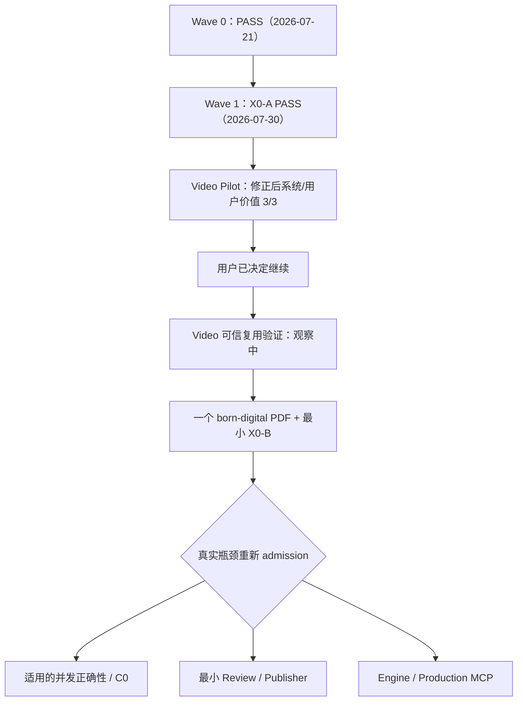

# AllToNote 总任务清单与 AI 交接说明

```yaml
doc_type: tasks
status: active
authority: execution
upstream:
  - ../README.md
  - alltonote-design-coverage-matrix.md
  - ../superpowers/specs/2026-07-13-alltonote-knowledge-compiler-architecture-design.md
downstream:
  - ../superpowers/plans/
implementation_status: live-handoff-and-progress-source
last_verified_at: 2026-07-30
```

- 文档类型：跨阶段总任务与交接入口
- 状态：当前有效
- 最后核验：2026-07-30
- 文档权威入口：[`docs/README.md`](../README.md)
- 文档主工作树：`G:\AllToNote`（`master`）
- 当前阶段工作树：`G:\.worktrees\AllToNote\video-dogfood-validation`（`codex/video-dogfood-validation`）

本文用于让下一位 AI 在不丢失架构上下文、不破坏未提交成果、不重复已经通过的工作前提下继续开发。本文记录执行优先级和状态，但不高于已发布 iwiki 合同、Knowledge Compiler 总体架构和适用下位设计。

## 1. 下一个 AI 的强制启动流程

### HANDOFF-01：读取权威文档

- 状态：`pending for every new executor`
- 优先级：P0

按顺序阅读：

1. [`docs/README.md`](../README.md)
2. 本文
3. [`设计覆盖、替代关系与实施矩阵`](alltonote-design-coverage-matrix.md)
4. [`Knowledge Compiler 总体架构`](../superpowers/specs/2026-07-13-alltonote-knowledge-compiler-architecture-design.md)
5. 当前任务依赖的下位设计和适用 ADR
6. 对应实施计划
7. 当前工作树、代码和测试证据

验收：执行者能够明确说出当前任务的上位设计、数据所有者、非目标和完成 Gate。

### HANDOFF-02：确认工作树，不清理用户成果

- 状态：`pending for every new executor`
- 优先级：P0

必须检查：

```powershell
git -C G:\AllToNote status --short
git -C G:\AllToNote branch --show-current
git -C G:\.worktrees\AllToNote\video-dogfood-validation status --short
git -C G:\.worktrees\AllToNote\video-dogfood-validation branch --show-current
git -C G:\.worktrees\AllToNote\iwiki-readonly-client status --short
```

当前已知事实：

- `G:\AllToNote` 是文档主工作树，分支为 `master`。
- `G:\.worktrees\AllToNote\video-dogfood-validation` 是当前阶段 worktree，分支为 `codex/video-dogfood-validation`。
- `G:\.worktrees\AllToNote\iwiki-readonly-client` 是独立 iWiki 只读 CLI worktree，不属于当前 Dogfood 依赖。
- 历史路径 `G:\AllToNote-video-producer` 已不存在，也没有残留 Git worktree 注册，不得继续把它写成活跃路径。
- `G:\AllToNote` 中未跟踪的 `AGENTS.md` 与 `config/` 是用户本地内容，不得复制、提交、移动或清理。
- 不得使用 `git reset --hard`、`git checkout --`、递归删除或批量覆盖。
- 未经用户明确授权，不 stage、commit、push、合并或移动分支。

验收：执行者先报告工作树事实和计划触碰的文件，再进行修改。

### HANDOFF-03：确认已验收基线，再由真实 Dogfood 建立新基线

- 状态：`X0-A accepted on 2026-07-30; Dogfood technical/user gate repaired 3/3; reliability gap retained`
- 优先级：P0

X0-A 最终全量回归：

```text
1906 passed
2 skipped
1 warning
3 subtests passed
```

Windows 本地视频 smoke：

```text
1 passed, 14 deselected, 1 warning
model=tiny; device=cpu; compute_type=int8
ffmpeg=8.1.2
```

权威证据：[`Recipe X0-A Task 8 验收报告`](../acceptance/2026-07-30-recipe-x0a-task-8.md)。`tiny` 只证明安装/运行，不是 Dogfood 的质量模型。

当前阶段按 [`Video 三样本 Pilot tasks`](../design-docs/video-dogfood-validation/tasks.md) 使用已冻结的 `V01` 至 `V03`。在真实基线前不得先重写产品链路。代码修改开始前，在阶段工作树使用声明的 Python 环境运行受影响测试和完整回归：

```powershell
cd G:\.worktrees\AllToNote\video-dogfood-validation
python -m pytest -q
git diff --check
```

若命令依赖尚未准备，必须记录为环境前置而不是伪造测试结果。若基线失败，先判断是环境、外部平台还是代码回归；不要在原因不明时继续新功能。

## 2. 当前总体进度

| 能力域 | 状态 | 当前事实 |
|---|---|---|
| 文档控制面与详细设计 | `completed for current roadmap` | 18 个正式架构设计 ID、2 个阶段价值验证 ID、13 份新增实施计划、关系/替代矩阵、Research、ADR 和验收摘要已建立 |
| 产品与架构基线 | `confirmed` | AllToNote 是上层知识编译/积累平台；Production 是用例，Video/Article/Document/Codebase/Personal 是并列 Recipe；CLI/Desktop/MCP 共享 ProduceService；所有当前路线阶段已有下位设计 |
| iwiki Portable 消费/提交基础 | `implemented foundation` | AllToNote Bundle 已通过真实 iwiki semantic validation 和 commit |
| Knowledge Compiler Core | `implemented foundation` | Job、Attempt、Checkpoint、ExternalOperation、ModelExecutor、Quality、Bundle 基础已建立 |
| Video Producer v1/v2 Core | `mostly completed` | Wave 1A Runtime/CLI 基础、Portable Bundle、Knowledge/Faithful 多 Draft Core 已实现；VREL-02..11 与正式 Video/Desktop/Pack 发布矩阵未闭合 |
| 65 分钟长视频知识编译 | `completed after acquisition` | 7 Map + 1 Compose，Quality/commit/恢复通过 |
| 实时 YouTube acquisition | `blocked` | 当前 IP 与最新 Cookie 仍被 YouTube anti-bot 拦截 |
| Bilibili/本地视频正式发布矩阵 | `partially verified` | 有 Adapter/测试基础，仍需真实发布 Gate 汇总 |
| Runtime CLI / Feature Pack 产品面 | `Wave 1A complete; later waves pending` | RCP-00..07 / Wave 1A 已完成并有验收证据；Pack、完整 doctor/repair、Desktop Resolver、clean-machine/分发仍待实现 |
| Wave 0 基线与权威收敛 | `complete` | 2026-07-21：实际权威基线 `3a75d0eb921...` 已集成到实现提交 `066884da431...`；原 trailer 的 `3a75d0e410...` 为已记录的抄录错误；集成后 full backend、Windows smoke 与 `git diff --check` 通过 |
| Recipe X0-A | `complete` | Tasks 1–8 已通过架构、兼容、冷路径、全量 backend 与 Windows smoke Gate；范围止于 submission/control-plane 接缝，不包含数据面迁移或多 Job 并发 |
| Video 三样本 Pilot | `reliability gap; repaired system/user value 3/3` | 原用户结果 V01/V02 PASS、V03 FAIL；Evidence 默认呈现与跨拓扑术语修正后新 V03 用户 PASS；不能外推为 10 样本、字幕、本地文件、长视频或干净安装已验证 |
| Video 可信复用验证 | `in progress; observation only` | 只用三份最终 reading；2026-07-30 至不早于 2026-08-06；等待延迟检索 3/3 与至少 1 次自然下游复用 |
| Recipe X0-B | `pending; real Document/PPT-driven` | 必须由 Video 与真实 Document/PPT 第二消费者共同抽取 Result/Artifact/Repository/atomic commit、迁移与恢复边界，不得用伪消费者或纸面抽象代替 |
| Vault 选择/文件树/Markdown 阅读/搜索 | `design complete; implementation pending` | Core/CLI/Desktop 详细设计和计划已完成，目标闭环尚未实现 |
| Review/Publisher | `design complete; implementation pending` | 审批 hash、PublishPlan、personal/common 权限与失败语义已设计 |
| AgentExecutor | `design complete; implementation pending` | Codebase/UE5 所需受控 AgentExecutor/ExecutionGrant 尚未实现 |
| Thin Desktop | `design complete; implementation pending` | Desktop API、Runtime Resolver、Vault UI 与发布 Gate 均待实现；旧 BiliNote UI 不等于目标架构 |
| Knowledge MCP | `design complete; implementation pending` | 与 Production MCP 分离；默认 published-only stdio server |
| Engine/Production MCP | `deferred; re-admission requires product and technical evidence` | 设计保留；当前单 Job Dogfood 不需要 Engine。只有可信复用后出现真实多 Job/后台瓶颈，且模型 turn、SQLite 与 per-job authority Gate 可证明时才重新 admission |
| Article/Wiki/PDF/PPT Recipe | `design complete; implementation pending` | 可先使用 foreground durable Job，不依赖 Engine |
| UE5/Codebase/Personal Recipe | `design complete; implementation pending/deferred by gates` | Code prototype等待 Recipe 合同验证；Personal manual MVP 可先做，scheduler 等 Engine |
| 网站账号/邀请/下载/设备/公共知识 | `design complete; implementation deferred` | 网站不保存个人 Markdown，等待本地产品和合规 Gate |
| Windows 正式分发 | `design complete; implementation pending` | 仍缺签名安装、Pack、升级、回滚、卸载和 clean-machine E2E |
| macOS Tier 2 | `designed; deferred` | Windows 闭环及共享合同稳定后进行签名/notarization/E2E |

直观判断：**当前路线的设计工作已经补齐，但产品实现远未整体完成。** 已经较成熟的是 Portable/Model/Video 长视频编译内核；尚未证明的是用户是否愿意保留和重复使用结果。不要把“架构设计都有计划”误报成“产品价值或对应能力已经可用”。

## 3. 已完成任务：不要重复开发

以下能力已经完成核心实现和回归。除非有明确缺陷，不要另起第二套实现：

### DONE-PORTABLE-01：Portable Bundle 基础

- Source/SourceRevision
- Artifact/EvidenceRef
- Transcript/Evidence/Draft/Quality/Receipt
- 多 Draft v2 扩展
- semantic validation
- atomic commit
- Job Result 回写
- v1 兼容投影

权威设计：

- [`Portable Artifact 与 Source Bundle`](../superpowers/specs/2026-07-14-alltonote-portable-artifact-source-bundle-design.md)

约束：实际 iwiki 已发布合同高于 AllToNote 私有解释。

### DONE-MODEL-01：单次模型执行底座

- Provider-independent `ModelExecutionRequest/Result`
- `ModelCallCoordinator`
- ExternalOperation
- 成功结果先持久化后完成
- outcome unknown 不自动重放
- Codex App Server Bridge
- stage-specific reasoning effort
- compiler identity 与恢复漂移检查

约束：不要把长视频分块、重试、Quality 或 Bundle 重新塞入模型 Adapter。

### DONE-VIDEO-LONG-01：Knowledge Note v2

- Transcript Quality Assessment
- deterministic Chunk Plan
- Knowledge Map
- Global Compose
- Citation Freeze
- 唯一 H1/标题层级/重复标题/H2 Evidence/覆盖账本 Gate
- 最多一次定向 Repair
- checkpoint 和恢复

### DONE-VIDEO-FAITHFUL-01：高保真精编稿

- `knowledge-note` 与 `faithful-edition` 独立输出
- 默认保留来源语言
- 显式中文翻译策略
- 独立 Quality
- 同 Bundle 多 Draft 原子提交

### DONE-VIDEO-E2E-01：65 分钟编译验收

验收输入：目标 YouTube 视频曾成功获取并持久化的真实平台字幕。

结果：

```text
Transcript segments: 1494
Duration: 3934.55 seconds
Knowledge Map calls: 7
Global Compose calls: 1
Sequential waves: 2
Repair calls: 0
Initial elapsed: 568.4 seconds
H1: 1
H2: 9
Duplicate H2: 0
Evidence uses: 87
Evidence definitions: 84
Quality: pass
Publish eligible: true
iwiki semantic validation: valid
Restart metadata/subtitle/model replay: 0
```

限制：这证明 acquisition 之后的真实长视频编译闭环，不证明当前网络可以重新实时访问 YouTube。

详细子任务状态：

- [`长视频 Task 1-15`](../superpowers/specs/tasks.md)
- [`脱敏稳定验收摘要`](../acceptance/2026-07-18-long-video-knowledge-compilation-v2.md)

## 4. 当前阻塞任务

### BLOCKED-YOUTUBE-01：实时 YouTube URL acquisition

- 状态：`blocked by external platform`
- 优先级：P0 发布 Gate，但无新外部条件时不应反复重试
- 上位设计：`REC-VIDEO-001`
- 专项设计：`REC-VIDEO-LONG-001`

当前复现：

```text
Sign in to confirm you’re not a bot
```

已尝试：

- 用户导出的最新 Cookie；
- 本机 Node.js JavaScript Runtime；
- 只取 metadata 的无下载探测；
- 结果仍被 YouTube 风控拒绝。

解除阻塞条件至少满足一项：

- 新的有效登录/Cookie 条件；
- 网络/IP 条件变化；
- 经验证的浏览器会话安全采集方案；
- 合法可用的替代 acquisition Adapter。

解除后必须无缓存运行：

```text
URL -> metadata -> subtitles/audio -> Transcript -> v2 compile
    -> Quality -> Bundle -> iwiki commit -> restart zero replay
```

禁止：

- 使用 Fake Runtime 冒充成功；
- 把缓存 Transcript 验收宣称为实时 URL 获取成功；
- 输出 Cookie 内容；
- 失败后静默生成无来源笔记。

## 5. 下一阶段可执行任务

任务只能在前置 Gate 成立后进入。一个任务完成后更新本文状态和验收证据。

### VALUE-VIDEO-01：Video 三样本 Pilot

- 状态：`reliability gap; repaired system/user value 3/3`
- 优先级：历史 P0；Pilot 已关闭
- 工作树：`G:\.worktrees\AllToNote\video-dogfood-validation`
- 分支：`codex/video-dogfood-validation`
- 设计：[`Video 三样本 Pilot 规格`](../design-docs/video-dogfood-validation/spec.md)
- 任务：[`Video 三样本 Pilot 任务`](../design-docs/video-dogfood-validation/tasks.md)
- 样本：[`V01–V03 冻结登记`](../design-docs/video-dogfood-validation/samples.md)

范围：

1. 用户已冻结 `V01` 至 `V03` 三个 Bilibili 短视频，不再提供额外校准集或正式样本；
2. 冻结 Runtime 字幕发现优先、`faster-whisper small` CPU/int8 回退、Codex app-server + `gpt-5.6-sol`、单活跃 Job和 CLI-first Golden Path；
3. 先建立可复现源码环境，再按顺序运行 `V01`、`V02`、`V03`，不得先扩架构；
4. 任一样本失败时每轮只修复首要根因，最多两轮，并分开记录首次/修复后结果；
5. 系统链路与用户价值分别以 `3/3` 报告；7 天保留作为后续观察，不阻塞三份技术结果；
6. 明确 `3/3` 不能外推为原 `8/10`、字幕成功、本地文件、长视频、干净 Windows 或多用户验证。

非目标：Document/PPT、完整 C0、多 Job、Engine、Publisher、Desktop GUI、多 Provider、自动 iWiki 发布、正式安装器与完全离线模型。

完成决策：首次系统/用户价值均 `3/3` 时也只判 Pilot PASS，由用户显式决定是否扩大验证或进入可信复用；首次不足但修复后 `3/3` 时先报告可靠性缺口；修复后仍不足 `3/3` 时判 Pilot FAIL 并停止扩张。

### VALUE-VIDEO-REUSE-01：Video 可信复用验证

- 状态：`in progress; observation only`
- 优先级：P0，当前唯一活动
- 开始：2026-07-30；最早结束：2026-08-06
- 规格：[`VAL-VIDEO-REUSE-001`](../design-docs/video-trusted-reuse-validation/spec.md)
- 任务：[`可信复用任务`](../design-docs/video-trusted-reuse-validation/tasks.md)
- 日志：[`观察日志`](../design-docs/video-trusted-reuse-validation/observation-log.md)

范围：只观察 V01–V03 三份最终 reading 的保留、延迟检索和自然下游复用；不增加输入、不调用 ASR/LLM、不改产品代码。前三天不做计划性检索；第 4–7 天完成三个固定问题；整个窗口记录自然复用。

Gate：完整性与保留 `3/3`、延迟检索 `3/3`、至少 1 次自然下游复用、单次必要清洗不超过 10 分钟才 PASS；检索通过但没有自然复用为 NO-SIGNAL；任一阻塞性检索、事实或清洗失败为 FAIL。只有 PASS 才允许请求一个 born-digital PDF + 最小 X0-B，仍不得自动启动实现。

### RELEASE-VIDEO-01：收敛 Video Producer 发布矩阵

- 状态：`pending`
- 优先级：P1，作为 `VALUE-VIDEO-01` 暴露真实发布缺口时的受控技术收敛来源，不再独立于产品证据自动启动
- 依赖：`HANDOFF-01` 至 `HANDOFF-03`、Wave 0 PASS，以及 `VALUE-VIDEO-01` 的真实基线证据
- 设计：
  - [`Video Producer`](../superpowers/specs/2026-07-14-alltonote-video-producer-design.md)
  - [`Portable Artifact`](../superpowers/specs/2026-07-14-alltonote-portable-artifact-source-bundle-design.md)
  - [`Runtime / CLI / Feature Pack`](../superpowers/specs/2026-07-18-alltonote-runtime-cli-feature-pack-design.md)
- 逐步计划：[`Video Producer 发布收敛计划`](../superpowers/plans/2026-07-18-alltonote-video-release-implementation-plan.md)

范围：

1. 汇总并补齐 Bilibili 平台字幕黄金路径。
2. 汇总并补齐本地视频 Faster Whisper 黄金路径。
3. 验证字幕优先路径不下载媒体、不加载 Whisper。
4. 验证无字幕时按明确策略回退音频/转写。
5. 验证 Cookie、FFmpeg、模型和转写配置失败时 fail closed。
6. 验证中文路径、取消、崩溃恢复、零重复下载和零重复付费调用。
7. 将真实 Smoke 结果写入脱敏验收摘要。

完成 Gate：

- Bilibili 字幕路径真实通过；
- 本地视频 Whisper 路径真实通过；
- Bundle semantic validation/commit 通过；
- 重启零重放；
- 完整回归无退化；
- YouTube 若仍被外部阻塞，独立报告而不阻断其他两条发布证据。

### RELEASE-CLI-01：补齐 Headless CLI 自动化面

- 状态：`completed`（2026-07-18；Wave 1A 范围 RCP-00 至 RCP-07、VREL-00/VREL-01；RCP-08+ 另属后续 Goal）
- 优先级：P0
- 依赖：当前 Video Job/错误合同和 Portable capability 基线可运行
- 设计：[`RUNTIME-001`](../superpowers/specs/2026-07-18-alltonote-runtime-cli-feature-pack-design.md)、`ARCH-001`、`REC-VIDEO-001`
- 逐步计划：[`Runtime、CLI 与 Feature Pack 实施计划`](../superpowers/plans/2026-07-18-alltonote-runtime-cli-feature-pack-implementation-plan.md)
- 验收证据：[`Runtime/CLI Wave 1A acceptance`](../acceptance/2026-07-18-runtime-cli-wave-1a-baseline.md)。Gate 0 为 `1731 passed, 2 skipped, 3 warnings, 3 subtests passed`；最终 Gate 为 `1820 passed, 2 skipped, 3 warnings, 3 subtests passed`，`git diff --check` 退出码 0。

目标命令：

```text
alltonote runtime info
alltonote runtime doctor
alltonote runtime capabilities
alltonote job get/list/wait/events/cancel/respond/retry
alltonote artifact inspect
alltonote draft inspect
```

`pack list/install/verify/remove` 属于 RCP-08 以后，不计入本次 Wave 1A 完成定义。

完成 Gate：

- 无 Desktop 时 Agent 可以提交、查询、等待、取消和判断结果；
- JSON envelope、退出码和错误分类稳定；
- 不泄漏路径、Prompt、Secret 或 Provider raw；
- 终态 Job 不复活，retry 创建新 Job。
- canonical `produce video --input` 与位置参数兼容 alias 共用同一 request/hash/执行链；重启后 Job/Artifact/Draft 可检查且 completed Job 零外部重放。

### VAULT-01：Phase 2A Core 与安全文件访问

- 状态：`pending`
- 优先级：P0，Video 发布闭环后的第一大产品任务
- 设计：
  - [`Knowledge Compiler`](../superpowers/specs/2026-07-13-alltonote-knowledge-compiler-architecture-design.md)
  - [`CLI-First Vault`](../superpowers/specs/2026-07-13-alltonote-cli-first-vault-workspace-design.md)
  - [`ADR-0001：机器状态位于 Vault 之外`](../decisions/ADR-0001-machine-state-outside-vault.md)
- 现有基础计划：[`iwiki Read-Only Client Foundation`](../superpowers/plans/2026-07-12-alltonote-iwiki-readonly-client.md)
- 当前总计划：[`Vault Core、CLI 与薄 Desktop 实施计划`](../superpowers/plans/2026-07-18-alltonote-vault-desktop-implementation-plan.md)

范围：

- `IWikiGateway/IWikiSession`
- `WorkspaceInspector`
- `VaultBrowser`
- `KnowledgeSearch`
- `WorkspaceCatalog`
- `LocalVaultFileAdapter`
- 路径授权、symlink/junction 和稳定读取
- 10,000 文档 fixture

完成 Gate：无需 FastAPI、React 或 Desktop，Core 能打开、浏览、读取和搜索真实 Workspace。

### VAULT-02：Phase 2B 独立 Vault CLI

- 状态：`pending`
- 优先级：P0
- 依赖：`VAULT-01`
- 逐步计划：[`Vault/Desktop plan`](../superpowers/plans/2026-07-18-alltonote-vault-desktop-implementation-plan.md)

目标命令：

```text
alltonote vault inspect
alltonote vault validate
alltonote vault tree
alltonote vault read
alltonote vault search
alltonote vault index-status
```

完成 Gate：没有 Desktop 的 Windows 环境可完成只读知识闭环，CLI 与未来 Desktop API 复用同一 Core。

### DESKTOP-01：Phase 2C 临时 Desktop API 与 Runtime Resolver

- 状态：`pending`
- 优先级：P1
- 依赖：`VAULT-01`、`VAULT-02`
- 逐步计划：[`Vault/Desktop plan`](../superpowers/plans/2026-07-18-alltonote-vault-desktop-implementation-plan.md)

范围：

- `alltonote desktop-api`
- loopback 随机端口和 token
- 版本/capability 握手
- SSE/任务状态
- Tauri Runtime 发现、启动和终止
- 在线、CLI-only、离线组合安装最小链路

完成 Gate：Desktop 安全连接独立 Runtime；普通 Web 无 Vault API；不兼容时 fail closed。

### DESKTOP-02：Phase 2D Vault UI

- 状态：`pending`
- 优先级：P1
- 依赖：`DESKTOP-01`
- 逐步计划：[`Vault/Desktop plan`](../superpowers/plans/2026-07-18-alltonote-vault-desktop-implementation-plan.md)

范围：

- Vault 选择和最近列表
- 懒加载文件树
- 安全 Markdown 阅读器
- TOC、本地资源和引用
- personal/common/combined 搜索
- 索引状态
- 外部编辑刷新
- 打开 Obsidian
- Job 状态入口

完成 Gate：用户可完成选择、浏览、阅读、搜索和外部编辑刷新；业务规则不进入 React/Tauri。

### DESKTOP-03：Phase 2E Windows 安全、性能与发布 Gate

- 状态：`pending`
- 优先级：P1
- 依赖：`DESKTOP-02`
- 逐步计划：[`Vault/Desktop plan`](../superpowers/plans/2026-07-18-alltonote-vault-desktop-implementation-plan.md)

范围：

- NTFS/reparse point/恶意路径
- 恶意 Markdown
- watcher overflow
- Runtime 崩溃
- 10,000 文档 p95
- 50,000 文档压力记录
- 安装、升级、回滚、卸载
- 卸载不修改或删除 Vault

### REVIEW-01：Review 与 Publisher MVP

- 状态：`design completed; implementation pending`
- 优先级：P1
- 依赖：Vault 只读闭环和 Portable 合同稳定
- 设计：[`REVIEW-001`](../superpowers/specs/2026-07-18-alltonote-review-publisher-design.md)、`ARCH-001`、`PROD-001`、`DATA-001`
- 逐步计划：[`Review 与 Publisher 实施计划`](../superpowers/plans/2026-07-18-alltonote-review-publisher-implementation-plan.md)

实现范围：

- Source/Evidence/Transcript/Draft 对照
- approve/reject/supersede
- Draft hash 失效
- PublishPlan/dry-run
- personal 默认发布
- common 当前计划强确认
- conflict、原子 apply、回滚
- Review/Publish Desktop UI

完成 Gate：形成“生产 -> 审阅 -> `wiki/personal`”第一个完整产品闭环；Agent 不能绕过审阅写正式知识。

### MCP-READ-01：本地只读 MCP

- 状态：`design completed; implementation pending`
- 优先级：P1
- 依赖：`VAULT-02`，不依赖 daemon
- 设计：[`MCP-READ-001`](../superpowers/specs/2026-07-18-alltonote-knowledge-access-mcp-design.md)
- 逐步计划：[`Knowledge Access MCP 实施计划`](../superpowers/plans/2026-07-18-alltonote-knowledge-access-mcp-implementation-plan.md)

范围：

- stdio MCP
- inspect/tree/search/read
- document metadata/backlinks
- Evidence/Source/Transcript range
- Workspace Grant
- 默认只读 `wiki/`，不读取 `raw/personal`

完成 Gate：本地 Codex 和其他 Agent 不启动 Desktop 即可受控读取已发布知识。

### RECIPE-CONTRACT-01：分阶段建立 X0-A，并由真实 Document/PPT 驱动 X0-B

- 状态：`design completed; X0-A Tasks 1-8 accepted; X0-B pending`
- 优先级：P2，等待 Video 单次价值与可信复用
- 依赖：X0-A 已完成；X0-B 必须由可信复用后的一个真实 born-digital PDF 第二消费者驱动。串行 foreground 纵切不把完整 C0 作为逻辑前置；若实现触及并发模型 turn、多连接 SQLite 或多 Job authority，则先关闭对应 C0 Gate
- 设计：[`REC-CONTRACT-001`](../superpowers/specs/2026-07-18-alltonote-recipe-extension-contract-design.md)
- 逐步计划：[`Recipe 最小扩展合同实施计划`](../superpowers/plans/2026-07-18-alltonote-recipe-extension-contract-implementation-plan.md)

范围：X0-A 只建立 Recipe identity/descriptor/input/request/submission、submit-only endpoint、静态官方 Registry、薄 ProduceService 与 Video adapter；CLI 只保留单一 `produce` 主入口，不发布活跃 `add` 或独立 `run` 主入口。X0-A 不修改 SQLite schema、legacy request/result wire、hash、config snapshot、Checkpoint、Portable 或 atomic commit，也不清除 Job/Repository 数据面的 Video-specific 类型。

分阶段 Gate：X0-A 已证明 Video 零语义变化以及 legacy/generic `produce` 共用 canonical request、Job identity、hash 和 config snapshot。当前先完成 Video 单次价值与可信复用；随后由 Video 与一个最小真实 born-digital PDF 纵切共同抽取 Result、Artifact、Repository、atomic commit、durable query、迁移和恢复边界。PDF 不得在 X0-B 的 legacy dual-read、migration、atomicity、恢复和 import Gate 通过前合入；Article/Wiki 后续再验证第三类来源，全部通过前不冻结公共插件 SDK。

### ENGINE-01：按需 Engine 与 Production MCP

- 状态：`deferred; product re-admission and technical gates required`
- 优先级：P3
- 依赖：Video 可信复用后出现被测用户的真实多 Job、detach 或后台执行瓶颈；同时完成模型 turn 隔离、SQLite 版本/并发策略、per-job authority、恢复和零重复副作用 Gate。Engine 不得提前成为 foreground CLI 或 Recipe 的依赖
- 设计：[`ENGINE-001`](../superpowers/specs/2026-07-18-alltonote-engine-production-mcp-design.md)、[`ADR-0001`](../decisions/ADR-0001-machine-state-outside-vault.md)
- 条件式计划：[`Engine 与 Production MCP 实施计划`](../superpowers/plans/2026-07-18-alltonote-engine-production-mcp-implementation-plan.md)

范围：

- `--detach`
- on-demand Engine
- scheduler/worker lease
- durable events
- resource-aware scheduling
- cancel/reconcile
- Production MCP
- Runtime/Pack 活动版本保护

完成 Gate：杀死 Desktop、CLI、Worker 或 Engine 后不产生半提交 Artifact，Job 状态可确定恢复。

### RECIPE-WEB-01：Article/Wiki Recipe

- 状态：`design completed; implementation pending`
- 优先级：P3
- 依赖：Video 可信复用、一个真实 PDF + X0-B、Portable/Runtime；调研可独立进行，正式合入位于 PDF/X0-B 之后；MVP 可用 foreground durable Job，不依赖 Engine
- 设计：[`REC-WEB-001`](../superpowers/specs/2026-07-18-alltonote-article-wiki-recipe-design.md)
- 逐步计划：[`Article / Wiki Recipe 实施计划`](../superpowers/plans/2026-07-18-alltonote-article-wiki-recipe-implementation-plan.md)

范围：canonical URL、网页快照、段落 Evidence、登录/付费墙/版权、freshness、Browser Extension 标准请求。

### RECIPE-DOC-01：PPT/PDF/OCR Recipe

- 状态：`design completed; implementation pending`
- 优先级：P2，Video 可信复用后的第二来源
- 依赖：X0-A、Video 单次价值 Gate 与 Video 可信复用 Gate；首个纵切只使用一个真实 born-digital PDF 驱动 X0-B。串行 foreground 实现不依赖完整 C0；若触及适用并发边界则先关闭对应 Gate
- 设计：[`REC-DOC-001`](../superpowers/specs/2026-07-18-alltonote-document-recipe-design.md)
- 逐步计划：[`Document Recipe 实施计划`](../superpowers/plans/2026-07-18-alltonote-document-recipe-implementation-plan.md)

范围：page/slide/bbox Evidence、图片、表格、OCR、多 Artifact、大文件流式处理。

### RECIPE-CODE-01：UE5/Codebase Agent Recipe

- 状态：`design completed; prototype pending`
- 优先级：P3
- 依赖：Recipe internal v1 经 Web/Document 验证；AgentExecutor/ExecutionGrant 边界稳定
- 设计：[`REC-CODE-001`](../superpowers/specs/2026-07-18-alltonote-codebase-ue5-recipe-design.md)
- 逐步计划：[`Codebase / UE5 Recipe 实施计划`](../superpowers/plans/2026-07-18-alltonote-codebase-ue5-recipe-implementation-plan.md)

范围：repo/commit snapshot、file/line/symbol Evidence、只读 grant、多阶段事实回验、增量分析、专业评测集。UE5 逻辑进入独立 Feature Pack，不污染通用 Core。

### RECIPE-PERSONAL-01：Personal Work Digest

- 状态：`design completed; manual MVP pending; scheduler deferred`
- 优先级：P3
- 依赖：手动 Git/Markdown Daily MVP 依赖 Review/Publisher；定时/后台部分才依赖 Engine/scheduler
- 设计：[`REC-PERSONAL-001`](../superpowers/specs/2026-07-18-alltonote-personal-work-digest-design.md)
- 逐步计划：[`Personal Work Digest 实施计划`](../superpowers/plans/2026-07-18-alltonote-personal-work-digest-implementation-plan.md)

范围：先做用户显式触发的 Git 活动和 Markdown 日志日摘要；再依据真实使用决定会议、周报、watch trigger、增量 checkpoint 和后台预算。默认 personal，不做隐形监控。

### CLOUD-01：网站与公共知识控制面

- 状态：`design completed; implementation deferred until local product stable`
- 优先级：P3
- 依赖：本地闭环稳定
- 设计：[`CLOUD-001`](../superpowers/specs/2026-07-18-alltonote-site-control-plane-design.md)
- 条件式计划：[`网站控制面实施计划`](../superpowers/plans/2026-07-18-alltonote-site-control-plane-implementation-plan.md)

范围仅限：账号、邀请、设备、下载、Runtime/Pack 版本、公共 MCP/知识包目录、订阅/配额。网站不保存用户个人 Markdown 正文。

### PLATFORM-WIN-01：Windows Tier 1 正式分发

- 状态：`design completed; implementation pending after product gates`
- 优先级：P2
- 依赖：Runtime/CLI、Bilibili/本地 Video、Vault/Desktop 和 personal Publisher 最小闭环
- 设计：[`RELEASE-001`](../superpowers/specs/2026-07-18-alltonote-platform-release-design.md)
- 逐步计划：[`Windows / macOS 发布实施计划`](../superpowers/plans/2026-07-18-alltonote-platform-release-implementation-plan.md)

范围：签名的轻量 Desktop、独立托管 Runtime、signed Pack manifest、在线与离线安装、原子升级/回滚、卸载保留 Vault、中文路径/非管理员/clean-machine E2E。模型权重和所有重依赖不塞入一个巨型 EXE。

### PLATFORM-MAC-01：macOS Tier 2

- 状态：`deferred`
- 优先级：P4
- 依赖：Windows Tier 1 发布 Gate 和共享 Core 稳定
- 设计/计划：[`RELEASE-001`](../superpowers/specs/2026-07-18-alltonote-platform-release-design.md) / [`Platform release plan`](../superpowers/plans/2026-07-18-alltonote-platform-release-implementation-plan.md)

范围：Apple Silicon、Keychain、APFS/FSEvents、签名、notarization、依赖打包和 E2E。

## 6. 文档治理任务

### DOC-01：建立文档控制面

- 状态：`completed 2026-07-18`

已完成：

- 新建 `docs/README.md`；
- 定义文件夹、命名、状态和优先级规则；
- 登记 18 个正式设计 ID；
- 新建本总任务清单；
- 新建设计覆盖/替代/实施矩阵；
- 明确主工作树与实现 worktree 分离。

### DOC-02：回写现有设计状态元数据

- 状态：`completed 2026-07-18`
- 优先级：P1 文档治理
- 前置：用户确认本控制面

已完成：

1. 把 `ARCH-001` 标为 `active/confirmed`，修正“待用户确认”。
2. 把 `PROD-001` 标为 `partially-superseded`，列出仍有效和被取代章节。
3. 把 `SUB-VAULT-001` 标为 `active/implementation pending`。
4. 把 `DATA-001` 的 capability 描述标为写作时快照；不冻结假定版本，要求实现时查询当前 published capability/schema/validator。
5. 把 `REC-VIDEO-001` 标为 `active/implementation mostly complete`。
6. 把 `REC-VIDEO-LONG-001` 更新为已完成核心实现，保留实时 acquisition 阻塞。
7. 把旧 Codex 文档标为 `partially-superseded`，明确新的 ModelExecutor 所有权。

验收：7 份早期设计均已补充治理元数据、当前解释和明确的替代边界。

### DOC-03：同步主仓库与实现 worktree 文档

- 状态：`pending explicit Git action`
- 优先级：P1

当前问题：

- 主工作树有最新长视频设计和任务状态；
- 实现 worktree 缺少这些文件；
- 多份同名设计在两个分支内容 Hash 不一致。

任务：

1. 比较分支提交祖先和文档 diff。
2. 明确 `G:\AllToNote\docs` 为文档权威源。
3. 通过正常 Git 合并/拣选同步，不手工覆盖未知更改。
4. 修复所有相对链接。
5. 经用户授权后再 stage/commit。

### DOC-04：创建稳定验收摘要

- 状态：`completed 2026-07-18`
- 优先级：P2

已创建 [`长视频 Knowledge Note v2 / Faithful Edition 验收摘要`](../acceptance/2026-07-18-long-video-knowledge-compilation-v2.md)，记录 65 分钟 E2E、Portable/iWiki、恢复、回归和未覆盖范围；未复制 Cookie、Prompt、私人正文或完整模型响应。

### DOC-05：补齐当前路线的详细设计和实施计划

- 状态：`completed 2026-07-18`
- 优先级：P0 交接

已完成：

- 一手资料市场/架构调研；
- Runtime/CLI/Feature Pack；
- Review/Publisher；
- Knowledge MCP；
- Engine/Production MCP；
- Recipe internal contract；
- Article/Wiki、Document、Codebase/UE5、Personal Work Digest；
- 网站控制面；
- Windows/macOS 发布；
- 上述 11 个新设计对应的 13 份实施计划；
- `ADR-0001` 机器状态与 Vault 分离；
- 上位章节覆盖、局部替代和依赖顺序矩阵。

结论：当前路线不存在必须先补设计才能开始的已知主阶段。后续若发现新范围或合同冲突，才返回设计层；否则按实施计划推进。

### DOC-06：文档链接、状态和依赖审计

- 状态：`completed 2026-07-18`
- 优先级：P0 交接

审计结果：

- 44 份受治理 Markdown：18 份正式设计、19 份计划、3 份 tasks、1 份 Research、1 份 ADR、1 份 Acceptance、1 份 README；
- 18 个设计 ID，18 个唯一值；
- 89 个非代码块相对 Markdown 链接，0 缺失；
- 136 个 YAML 上下游 `.md` 路径，0 缺失；
- 新计划 lifecycle status 已统一为 `active`，实施阶段由 `implementation_status` 表示；
- Markdown fence/trailing-whitespace 检查 0 问题；
- 当前 tracked diff 通过 `git diff --check`；
- README、覆盖矩阵和本清单均采用固定硬依赖链“Wave 0 -> X0-A -> C0 -> 真实 Document/PPT + X0-B -> Artifact/Review/Publisher -> Engine”；Engine 需求已触发，但生产实现仍被 Wave 0-4 阻塞。

历史说明：上条是 2026-07-18 审计当时的结论，不改写其完成记录。2026-07-30 的第一性原理复核已由 [`VALUE-VIDEO-01`](#value-video-01video-dogfood-单次价值验证) 局部取代“X0-A 后自动进入 C0”的执行顺序；旧技术设计保留，但当前 admission 先受 Video 单次价值与可信复用 Gate 约束。

## 7. 明确暂不做

在对应 Gate 前，不得擅自加入：

- 网站保存个人知识正文；
- 自动发布到 `wiki/common`；
- Agent 直接修改或删除正式知识；
- 用 SQLite、向量库或 QMD 替代 Markdown 事实源；
- 通用 YAML Workflow/DAG 平台；
- 未经多类 Recipe 验证的公共插件 SDK；
- 为了“未来可能需要”提前引入常驻 daemon；
- 把所有 Whisper、FFmpeg、模型权重塞入轻量 Desktop EXE；
- 在 Adapter 内重新实现分块、重试、Quality、Bundle 或 Publisher；
- 保留第二条新 FastAPI/CLI/Desktop 业务 Pipeline。

## 8. 任务执行和状态更新规则

1. 开始任务前，把状态更新为 `in_progress`，并记录使用的工作树和分支。
2. 每次只让一个任务处于 `in_progress`；并行子任务必须有互不冲突的写入范围。
3. 代码修改必须先有失败测试或明确可复现证据。
4. 完成任务必须记录验证命令和结果，不能只写“已实现”。
5. 外部平台阻塞标记为 `blocked`，不要伪装为代码完成或无限重试。
6. 设计缺口先修订设计；实现计划无权补造架构。
7. 完成子计划后同步本总清单，避免多个状态源漂移。
8. 不删除已完成任务；保留完成日期和验收摘要。
9. 不在文档中写 Secret、Cookie、Token、用户私人正文或完整 Provider raw。
10. 未经用户授权，不执行 Git stage、commit、push、merge、rebase 或发布。

## 9. 推荐的下一步

### 9.1 下一位 AI 的第一项具体工作

在没有新的用户优先级覆盖时：

1. 保留 Wave 1A、Wave 0、X0-A 的完成事实与验收证据；不把 X0-A 解释为并发或数据面通用化完成；
2. 使用 `codex/video-dogfood-validation` 和外置 worktree，不触碰 `master` 的 `AGENTS.md`、`config/` 或独立 iWiki 分支；
3. `V01` 至 `V03` 已完成：首次系统 `2/3`，链路修复后系统 `3/3`；原用户价值 V01/V02 PASS、V03 FAIL，术语修正后 V03 用户 PASS，修正后用户价值 `3/3`；历史结果不回写；
4. canonical Draft/EvidenceSet 继续作为审计权威；默认 `draft show` 使用已验证的干净阅读投影，核验时显式选择 `--presentation audit`；
5. 跨样本 ASR 专有名词修正已在 V02 DIRECT 与 V03 MAP_COMPOSE 客观复验通过，未使用私有字符串替换表；
6. 当前 Pilot 任务已关闭；用户已显式选择按最小范围进入 Video 可信复用验证，不扩大 Video 样本，也不自动启动其他阶段；
7. 当前不启动 Document、完整 C0、Review/Publisher、Engine、AgentExecutor、Thin Desktop 或公共插件 SDK。

当前唯一允许的主线是 `三样本 Pilot -> Video 可信复用验证 -> 一个 born-digital PDF + X0-B -> 按真实瓶颈重新 admission 后续能力`。

### 9.2 推荐执行波次



执行约束：

- Wave 1A、Wave 0 与 X0-A 均已完成；历史证据继续有效。
- Pilot 的 `3/3` Gate、数据边界、时间盒和停止条件以本阶段 spec/tasks 为准，不得测试后重写或外推为原 `8/10`。
- `VAL-VIDEO-REUSE-001` 只观察现有三份 reading；最早 2026-08-06 冻结 PASS / NO-SIGNAL / FAIL，窗口内不启动新实现。
- X0-B 仍为 pending，必须由可信复用后的一个真实 born-digital PDF 第二消费者驱动，不能先造通用 Result/Artifact/Repository 数据面。
- CLI 只保留单一 `produce` 主入口，不发布活跃 `add` 或独立 `run` 主入口。
- 当前单 Job Gate 不需要完整 C0；只有内部 fan-out 的 turn 隔离问题属于条件式最小修复。多 Job、SQLite 多 writer 和 Engine 仍受各自技术 Gate 约束。
- Engine 的历史需求记录继续保留，但需求记录不等于当前产品 admission；只有被测用户出现真实多 Job/后台瓶颈时才重新决策。
- AgentExecutor、Review/Publisher 与 Thin Desktop 均保持 pending；旧 BiliNote UI 不算 Thin Desktop 完成证据。
- 同一执行者一次只推进一个 master task；并行只允许互不冲突的调研、评测准备或读操作。
- `BLOCKED-YOUTUBE-01` 等待外部条件，不得用 Fake 或缓存验收改写其实时 acquisition 状态。

### 9.3 “完成”的报告格式

每个 task 完成后在本文追加：

```text
task_id:
status: completed | blocked
worktree / branch:
changed_files:
tests_and_results:
real_e2e:
performance:
artifact / bundle / receipt IDs or hashes:
known_limits:
next_task:
```

没有测试结果和真实 Gate 的任务只能标记 `partial`，不能因为文件已创建或单元测试通过就写成产品完成。
